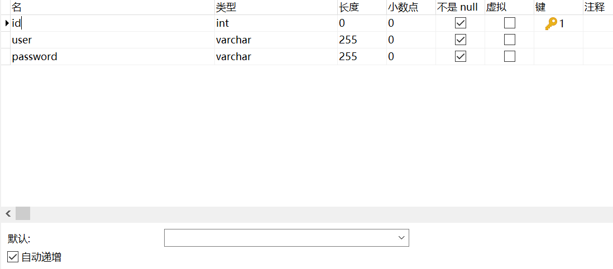

# 在Node中使用Mysql

安装

```shell
npm i mysql --save
```

npm中的mysql官网：[https://www.npmjs.com/package/mysql](https://www.npmjs.com/package/mysql)


示例

使用Navicat设计表



```javascript
var mysql      = require('mysql');
var connection = mysql.createConnection({
  host     : 'localhost',
  user     : 'root',
  password : 'root',
  database : 'user'
});
 
connection.connect();
 

connection.query('INSERT INTO user VALUES(null,"Jack","1234")', function (error, results, fields) {
    if (error) throw error;
    console.log('The solution is: ', results);
  });
/*
The solution is:  OkPacket {
  fieldCount: 0,
  affectedRows: 1,
  insertId: 5,
  serverStatus: 2,
  warningCount: 0,
  message: '',
  protocol41: true,
  changedRows: 0
}*/


connection.query('SELECT * FROM user', function (error, results, fields) {
  if (error) throw error;
  console.log('The solution is: ', results);
});
// The solution is:  [ RowDataPacket { id: 0, username: 'Jack', password: '123' },]
 
connection.end();

```

