# 什么是node.js

> 官网:https://nodejs.org/en/
>
> 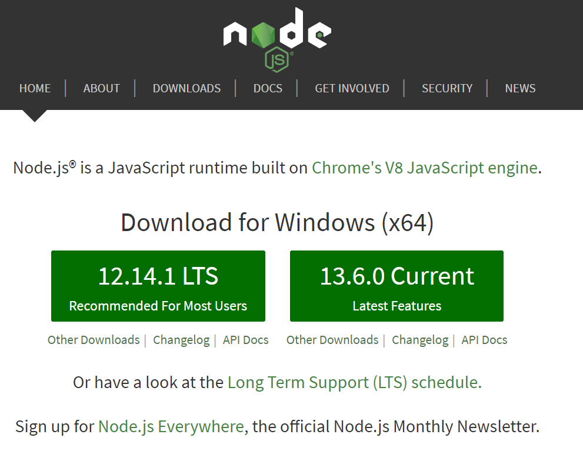

**“Node.js® is a JavaScript runtime built on Chrome's V8 JavaScript engine.”**

- Node.js不是一门语言
- Node.js不是库、不是框架
- Node.js是一个JavaScript运行时环境
- 简单来讲就是Node.js可以解析和执行JavaScript代码
- 现在的JavaScript可以完全脱离浏览器来运行，一切都归功于Node.js

**“ Node.js uses an event-driven, non-blocking I/O model that makes it lightweight and efficient. ”**

- event-driven事件驱动
- non-blocking I/O model非阻塞I/O模型（异步思想）
- lightweight and efficient轻量高效

**“ Node.js package ecosystem, npm, is the largest ecosystem of open source libraries in the world. ”**
- npm是世界上最大的开源库生态系统
- 绝大多数JavaScript相关的包都存放在了npm上，这样做的目的是为了让开发人员更方便的去下载使用。
- ```npm install jquery --save```

# 浏览器中的JavaScript

- ECMAScript
  - 基础的语法
  - if
  - var
  - function
  - Object
  - Array
- BOM
- DOM
# Node.js中的JavaScript

- **没有BOM、DOM**

- 有ECMAScript

- 在Node这个JavaScript执行环境中位JavaScript提供了一些服务器级别的操作API
  - 例如文件读写
  - 网络服务的构建
  - 网络通行
  - HTTP服务器
  - 。。。
  
- **核心模块**

  Node为JavaScript提供了很多服务器级别的API，这些API绝大多数都包装了一个具名的核心模块中了，比如文件操作的`fs`核心模块，http服务构建的`http`模块、`path`路径操作哦模块、`oc`操作系统信息模块......

- 构建与Chrome的V8引擎之上
  - 代码知识具有特定格式的字符串而已
  - 引擎可以识别这些字符串，引擎可以帮你去解析和执行
  - Google Chrome的V8引擎是目前公认的解析执行JavaScript代码最快的
  - Node.js的作者把Google Chrome中的V8引擎移植出来，开发了一个独立环境的JavaScript运行时环境。
# Node.js能做什么？

- Web服务器后台

- 命令行工具
  - nmp(node)
  - git(C语言)
  - hexo(node)
  - ......
  
- 游戏服务器，接口服务器...

- 对于前端开发工程师来说，接触node最多的就是它的命令行工具

  - 自己写得少，只要是使用别人第三方的
  - webpage
  - gulp
  - npm

# 预备知识

- HTML
- CSS
- JavaScript
- 简单的命令行操作
  - cd 
  - dir
  - ls
  - mkdir
  - rm
- 具备服务器开发经验更佳

# 推荐资源

- 《深入浅出Node.js》
  - 朴灵
  - 偏理论，几乎没有任何实战内容
  - 理解原理底层

- 《Node.js权威指南》
- Javascript标准参考教程（alpha）：http://javascript.ruanyifeng.com/bom/cors.html
- Node入门：http:///www.nodebeginner.org/indec-zh-cn.html
- 官方API文档：https://nodejs.org/dist/latest-v6.x/docs/api/
- 中文文档：http://www/nodeclass.com/api/node.html
- CNODE社区：http://condejs.org
- CNODE-新手入门： http://cnodejs.org/getstart

# 学习知识

- B/S编程模型
  - Browser-Server
  - back-end
  - 任何服务端技术的B/S变成模型都是一样的，与语言无关
  - Node只是作为学习BS编程模型的一个工具
- 模块化编程
  - less
  - RequireJS
  - SeaJS
  - `@import('文件路径')`
  - 在Node只可以像`@import`一样来引用加载JavaScript脚本文件
- Node常用API
- 异步编程
  - 回调函数
  - Promise
  - aysnc
  - generator
- Express Web开发框架
- ECMAScript 6
  - 新的语法
  - 新的特性
- ......

# 起步

## 代码规范

https://standardjs.com/readme-zhcn.html

https://github.com/sivan/javascript-style-guide/blob/master/es5/README.md

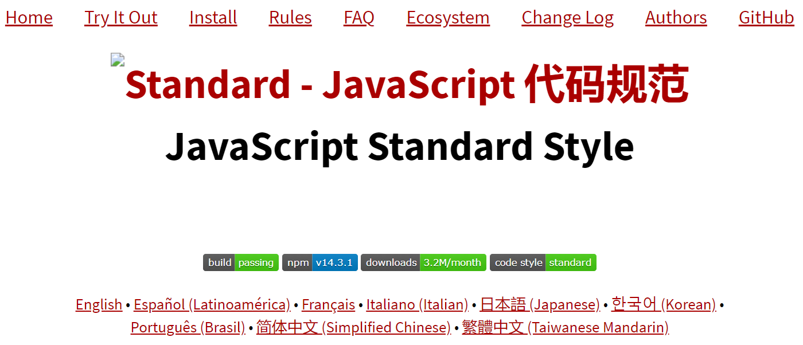

分号问题，编写的内容中，包括以下符号开头时，最好在前面加上`;`，避免出现一些问题，以体现更好的维护性。

- `(`
- `[`
- `

## 安装Node环境
[Node安装步骤](http://note.youdao.com/noteshare?id=97dfe5ab89d5386d4575bf4ebfd4ed2d)

- 下载：https://nodejs.org/en/download/
- 安装
  - 傻瓜式安装一路Next
  - 对于已经安装过的，更新安装就会升级
- 确认Node环境是否安装成功
  - 打开命令行，输入node --version
  - 或者node -v
- 环境变量
- 查看当前Node环境的版本号

## Hello World
1. 创建编写JavaScript脚本文件

2. 打开终端，定位到脚本文件所属的文件夹

3. 输入```node 文件名``` 执行对应的文件

   >  **注意**：文件名不要使用node.js来命名，也就是说除了node这个名字其他都可（其实也可，只是尽量避免），而且最好不要用中文。

- 解析执行JavaScript
- 读写文件
- http

**实践**

1. 创建文件  01-HelloWorld.js

```javascript
let name = 'cq' ;
console.log(name);
```

2. 在终端输入`node 01-HelloWorld.js`

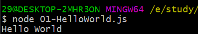

## 注意事项

**node没有DOM和BOM**

在node中，采用的是ECMAScript进行编码，所以没有DOM和BOM，就不存在window和document，尝试输出window和document会显示不存在。和浏览器中的JavaScript不一样

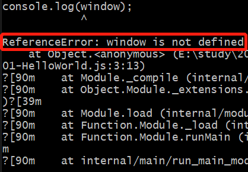

## 快捷自动重启服务工具

使用一个第三方工具， `nodemon` 可以帮助我们解决平凡修改代码重启服务器问题，`nodemon`是一个基于Node.js开发的第三方命令行工具，可通过以下命令进行安装

```bash
npm install --global nodemon
```

安装完毕之后，可以使用：

```bash
node app.js

# 使用nodemon
nodemon app.js
```

通过nodemon启动的服务，可以监视文件变化，当文件发生变化的时候，自动帮助你重启服务。

# 实践与理解

## 读取文件

```javascript
var fs = require('fs')
```

- fs是file-system的缩写，就是文件系统的意思
- 在Node中如果想要进行文件操作，就必须引入fs这个核心模块
- 在fs这个核心模块中，就提供了所有的文件操作相关的API
- 例如：fs.readFile就是用来读取文件的


1. 使用require()方法加载fs核心模块

   ```javascript
   var fs = require('fs')
   ```

2. 读取文件

   - 第一个参数就是要读取的文件路径
   - 第二个参数是一个回调函数
     - 成功
       - data 数据
       - error null
     - 失败
       - data undefined
       - error 错误对象

   ```js
   fs.readFile('testFile.txt', function(error, data){
       console.log(data);
   });
   ```

   

打印出来是`<Buffer e5 93 88 e5 93 88>`

这里其实是二进制转为16进制后的结果，因此需要使用toString()

方法。

```js
fs.readFile('testFile.txt',function(error, data){
  console.log(data.toString());
});
```

读取成功并输出：


**注意**

- 浏览器是不认识node中特定的API，在不同的运行环境有不同的运行结果，因此可以看出浏览器和node环境的是有区别的。

- data为undefined的时候尝试去使用toString()方法会报错，因此可以判断一下是否成功读取文件。

```js
if(error){
    console.log("读取文件失败！");
}else{
    console.log(data.toString());
}
```


- 尝试去读取不存在的文件，就发生错误，输出一个错误对象

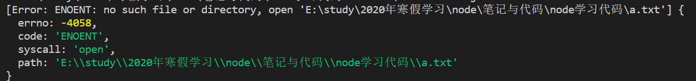

## 写入文件

```js
var fs = require('fs');
fs.writeFile('testFile.txt', '你们好！', function(error){
  console.log("文件写入成功！");
})
```

- 第一个参数：文件路径

- 第二个参数：文件内容

- 第三个参数：回调函数，接收的参数为error
  -  成功：
    - 文件写入成功
    - error是null
  - 失败：
    - 文件写入失败
    - error是错误对象

`node writeFile.js`

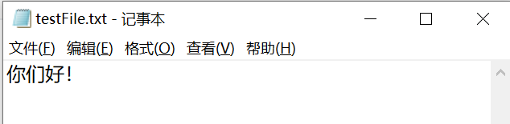

**注意**

-  尝试往一个不存在的文件写入内容，则首先创建文件后再写入。
- 命名规定不允许包含某些关键符号，尝试向一个不合法的文件名写入内容，会写入失败。

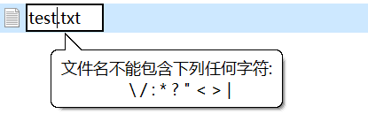

```js
fs.writeFile('a>.txt', '你们好！', function(error){ //错误文件名
    console.log(error);
})
```

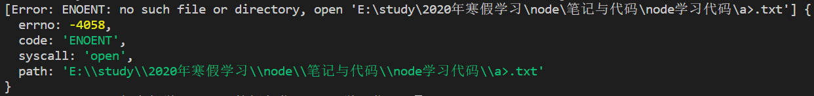

- error的作用

上面谈到error中的值是

- 成功：error是null
- 失败：error是错误对象

因此可以借助error来判断文件是否写入成功了

```js
fs.writeFile('a.txt', '你们好！', function(error){
    if(error){
        console.log('文件写入失败！');
    }else{
        console.log('文件写入成功！');
    }
})
```

## 创建Web服务器

下面做一个有趣的事情，就是用Node来创建一个Web服务器，Node很轻松就可以创建起来，在Node中专门提供了一个核心模块：http，这个http模块的职责就是帮助我么创建编写的服务器的。

1. 加载http核心模块

   ```js
   var http = require('http');
   ```

2. 使用http.createServer() 方法创建一个Web服务器

   - 返回一个Server实例

```js
var server = http.createServer()
```

> 理解服务器是干什么的？

> - 提供服务，是对数据的服务
> - 发请求
> - 接收请求
> - 处理请求
> - 发送响应

3. 注册request请求事件，设置请求处理函数

- 当客户端请求过来，就会自动触发服务器的request请求事件，然后执行第二个参数，也就是回调函数

```js
server.on('request', function(){
  console.log('收到客户端的请求了');
});
```

4. 绑定端口号，启动服务器

   涉及到网络通信的就一定需要端口号

   如果是访问http://127.0.0.1的话，浏览器默认会访问80端口。

```js
server.listen(3000, function(error){
    if(error){
        console.log('服务器开启失败！');
    }else{
        console.log('服务器已开启，可以通过http://127.0.0.1:3000/ 进行访问');
    }
})
```

在浏览器中打开http://127.0.0.1:3000/，可以看到一条客户端的请求，再刷新可以看到多条。


提示：当前服务正在等待状态，需要关闭服务的话按Ctrl+C即可。且两个服务不可以同时占用同一个端口。

### 附加：端口号

**什么是端口号？**

首先很好的区别于IP地址，所有联网络的程序都需要进行网络通信，计算机中只有一个物理网卡，而且同一个局域网中，网卡的地址都是唯一的，网卡就是通过唯一的IP地址进行定位的。我们的客户端可能需要访问服务器中的Apache服务器软件程序或者微信浏览器应用程序，那只有一台服务器计算机，只通过一个IP地址来进行访问是区分不了的，这时候就需要通过端口号进行规定通信路线。

**所谓的端口，就好像是门牌号一样，客户端可以通过ip地址找到对应的服务器端，但是服务器端是有很多端口的，每个应用程序对应一个端口号，通过类似门牌号的端口号，客户端才能真正的访问到该服务器。为了对端口进行区分，将每个端口进行了编号，这就是端口号。**

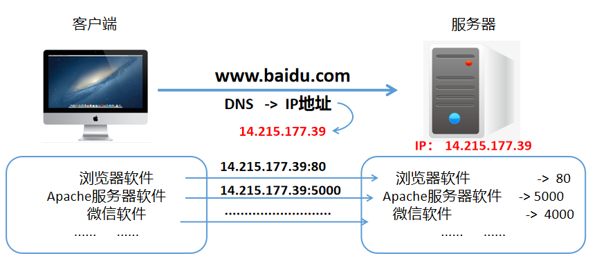

- IP地址是用来定位计算机的
- 端口号是用来制定具体应用程序的
- 端口号的范围是从0 ~ 65536 之间
- 一个端口号只能给一个应用程序占用
- 计算机中都一些默认的端口号，在练习的时候一般不去使用
  - HTTP 超文本传输服务 ：80
  - FTP 文件传输服务 ：21
  - DNS 域名解析服务： 53
  - HTTPS 加密的超文本传输服务： 443
  - MYSQL数据库端口：3306
  - ......

### 为服务器添加功能

上面所开启的服务器是不具备任何回应的，也不具备任何的数据处理能力，接下来我们为这个服务器添加功能。

- request 请求事件处理函数，需要接受两个参数
  - request 请求对象
    - 请求对象可以用来获取客户端的一些请求信息，例如请求路径`request.url`
  - response 响应对象
    - 相应对象可以用来给客户端发送相应消息

 因为我们的服务器的处理能力是很弱的，无论是什么路径的请求，返回的救过都是一样的。

  **思考：怎样让我们的服务器处理不同的请求相应不同的结果呢？**

  比如说：输入/（浏览器默认从/开始访问），这时候返回一个index

  				/login       返回login

 				/register     返回register

> 其实上面已经有一个入口了，那就是`request.url`这个路径的选择
>
> ```js
> var http = require('http');
> 
> var server = http.createServer();
> 
> server.on('request', function(req, res){
> var url = req.url;
> res.setHeader('Content-Type','text/html; charset=utf-8');
> 	//根据不同的请求路径，发送不同的响应内容    
> if(url == '/'){
>  //上面的一次响应一次关闭比较麻烦，建议使用更加简便的方法，直接写入end方法中，表示发送完后就关闭
>   res.end('index');
> }else if(url == '/login'){
>   res.end('login');
> }else if(url == '/register'){
>   res.end('register');
> }else{
>   res.end('404 Not Found!');
> }
> }).listen(3000, function(error){ //链式写法
>  if(error){
>      console.log('服务器开启失败！');
>  }else{
>      console.log('服务器已开启，可以通过http://127.0.0.1:3000/ 进行访问');
>  }
> })
> ```

再者，我们一般接收到的数据是JSON格式、数字、对象又或者是数组的，在发送之前以对象等形式发送的话，就会报错，<font color="red">因为只能响应**字符串或二进制数据**的内容</font>。

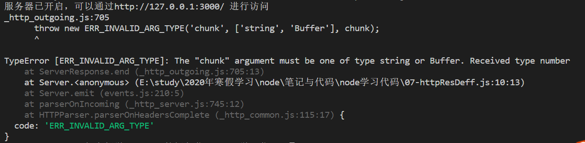

解决：使用`JSON.stringify()`方法将他们转化为字符串再发送。

```js
var http = require('http');

var server = http.createServer();

server.on('request', function(req, res){
    var url = req.url;
    res.setHeader('Content-Type','text/html; charset=utf-8'); 
    if(url == '/'){
        res.end('index');
    }else if(url == '/clothes'){
        var clothes = [
            {
                name: '衬衫',
                price: 400
            },
            {
                name: '裤子',
                price: 300
            },
            {
                name: '帽子',
                price: 150
            }
        ]
        res.end(JSON.stringify(clothes));
    }else if(url == '/fruits'){
        var fruits = [
            {
                name: '苹果',
                price: 5
            },
            {
                name: '香蕉',
                price: 3
            },
            {
                name: '葡萄',
                price: 6
            }
        ]
        res.end(JSON.stringify(fruits));
    }else{
        res.end('404 Not Found!');
    }
}).listen(3000, function(){ //链式写法
    console.log('服务器已开启，可以通过http://127.0.0.1:3000/ 进行访问');
})
```


- - -

```js
server.on('request', function(request, response){

  console.log('收到客户端的请求，客户端请求的路径是： ' + request.url);
  console.log("客户端的端口号： "+ request.socket.remotePort);
  console.log("客户端的远程地址： "+ request.socket.remoteAddress);

  // 内容类型: 规定响应文件类型以及编码方式
  response.setHeader('Content-Type','text/html; charset=utf-8');

  // response 对象的一个方法：write 可以用来给客户端发送相应数据
  // write可以用多次，但是最后一定要使用 end 来表示结束响应，否则客户端会处于一直等待的状态。
  response.write('客户端，你好！');
  response.write('我是Node服务器');

  // 告诉客户端，服务器的话说完了，客户端可以执行给用户了
  response.end();
})
```

### Content-Type

```js
// 内容类型: 规定响应文件类型以及编码方式
//服务器默认发送的是UTF-8编码格式的数据
//浏览器不知道服务器的编码方式，默认使用操作系统中的编码方式去解析，中文操作系统编码解析方式默认是gbk
//所以需要告诉浏览器发送过去的内容是UTF-8编码的数据，你应该使用这种编码方式解析。
//在http协议中，Content-Type是指发送数据内容的类型
response.setHeader('Content-Type','text/html; charset=utf-8');
response.setHeader('Content-Type','image/jpeg');
```

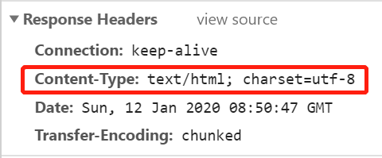

字段值分类：

- **文本文件**

  text/html， text/plain，text/css...
  application/xhtml+xml， application/xml...

- **图片文件**
  image/jpeg，image/gif， image/png...

- **视频文件**
  video/mpeg，video/quicktime...

- **应用程序使用的二进制文件**
  application/octet-stream， application/zip...

  查询地址：https://tool.oschina.net/commons/

## Node核心模块

Node为JavaScript提供了很多服务器级别的API，这些API绝大多数都包装了一个具名的核心模块中了，比如文件操作的`fs`核心模块，http服务构建的`http`模块、`path`路径操作哦模块、`oc`操作系统信息模块......

一提到核心模块，当需要使用的时候，就必须使用`require`

```js
var fs = require('fs');
var http = require('http');
.....
```

可参考： https://nodejs.org/dist/latest-v13.x/docs/api/

`require()` 它是一个方法，其作用是用来加载模块的，在Node中，有三种模块：

- 具名的核心模块，例如 fs 、 http、os...
- 用户编写的文件模块，注意：相对路径必须加上  `./`
- 第三方模块，可通过`npm install xxx --save`进行下载，比如art-template。

Node不具有全局作用域，只有模块作用域
- 外部访问不到内部
- 内部访问不到外部

这里举一个例子：

a.js

```js
var name = 'aaa';
require('./b.js');
console.log(name);
```

b.js

```js
var name = 'bbb';
```


输出

aaa

可得到，`b.js` 中的`name`并没有覆盖`a.js`中的`name`

- `require`是用来加载文件模块并执行。

相对路径必须添加 `./`   （不可以省略，没有`./`的话就认为是核心模块导致错误，后缀名可以省略）

- 引入的文件，会递归的去执行；node中不存在全局作用域，只存在**模块作用域**，简单来说就是文件作用域，
  模块作用域表示外部访问不到内部，内部访问不到外部。`b.js`中访问不到`a.js`中的`name`，`a.js`的变量`name`不会被`b.js`中的变量覆盖。只使用require，被引入的文件中的变量不会污染本文件的变量。

- 使用到了自定义模块的加载，本意上是想要访问内部的成员，但是现在只是单纯的加载并执行文件的话，就无法访问，这时候如何让模块与模块之间进行**通信**的话，例如b.js可以访问a.js 中的成员。
- 与require配对使用的有一个导出的方法：exports

### require方法作用

1. 加载文件模块并执行模块内的代码。
2. 拿到被加载模块文件中被导出的接口对象。

加载模块b.js使用`require('./b')`

如果b.js中没有使用exports进行导出的话，这时候拿到的就是一个空对象   ： `{}`

如果有使用exports进行导出，把所有需要被外部访问到的成员挂载到exports对象中，它会动态地为这个对象添加成员。

- 其中有一个目的是为了解决变量名的冲突的问题

```js
var require = require('./b.js');
console.log(require.age);
```

```js
var age = 20;
exports.age = age;
```

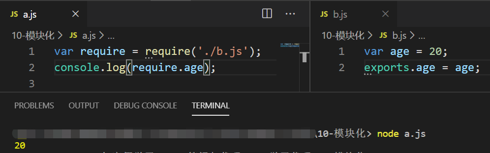

同样可以添加自定义方法并导出

```js
var require = require('./b.js');
console.log(require.add(1,2));
```

```js
exports.add = function(x, y){
    return x + y;
}
```

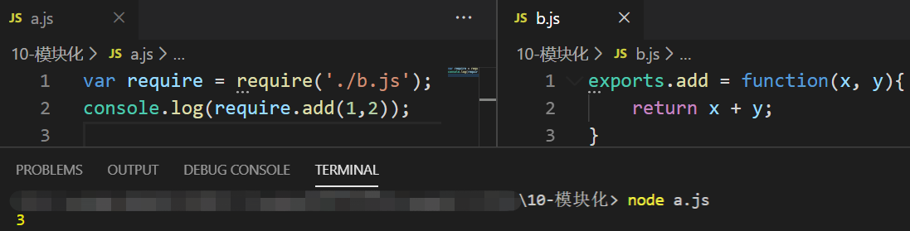

### http结合readFile实现传输文件数据

理解性复杂代码，后续有优化。

```js
var http = require('http');
var fs = require('fs');

var server = http.createServer();

server.on('request', function(req, res){
    var url = req.url;
    if (url === '/') {
        fs.readFile('index.html',function(error,data){
            if(error){
                res.setHeader('Content-Type','text/plain; charset=utf-8');
                res.end('读取文件错误');
            }else {
                res.setHeader('Content-Type','text/html; charset=utf-8');
                res.end(data.toString());
            }
        })
    } else if(url === '/css'){
        fs.readFile('style.css',function(error,data){
            if(error){
                res.setHeader('Content-Type','text/plain; charset=utf-8');
                res.end('读取文件错误');
            }else {
                res.setHeader('Content-Type','text/css; charset=utf-8');
                res.end(data.toString());
            }
        })
    }else if(url === '/study'){
        fs.readFile('study.jpg',function(error,data){
            if(error){
                res.setHeader('Content-Type','text/plain; charset=utf-8');
                res.end('读取图片错误');
            }else {
                res.setHeader('Content-Type','image/jpeg'); //图片无需编码
                res.end(data);
            }
        })
    }else {
        res.end('404 Not Found!');
    }
}).listen(3000,function(error){
    if (error) {
        console.log('访问服务器失败！');
    } else {
        console.log('访问服务器成功，可以打开 http://127.0.0.1:3000 进行访问');
    }
})
```

这样写可能就会想，有多少个文件需要请求就要有多少个`if-else`，而且还有未知的路径，这时候我们可以通过用户输入的路径进行动态的更改文件读取的路径。

#### 优化

```js
var http = require('http');
var fs = require('fs');

var server = http.createServer();
var wwwDir = 'E:/study/test'; //这里填入默认路径

server.on('request',function(req, res){
    var url = req.url;

    var filePath = '/index.html';

    if(url !== '/'){
        filePath = req.url;
    }
    fs.readFile(wwwDir + filePath,function(error, data){
        if(error){
            return res.end('404 Not Found');
        }
        res.end(data);
    })


}).listen(3000, function(error){
    if(error){
        console.log('服务器开启失败！');
    }else{
        console.log('服务器已开启，可以通过http://127.0.0.1:3000/ 进行访问');
    }
})
```


```html
<!DOCTYPE html>
<html lang="en">
<head>
    <meta charset="UTF-8">   <!-- 指定编码方式  -->
    <meta name="viewport" content="width=device-width, initial-scale=1.0">
    <meta http-equiv="X-UA-Compatible" content="ie=edge">
    <title>Node学习</title>
</head>
<body>
    你好，Node.js
</body>
</html>
```

进一步简写

```js
var http = require('http');
var fs = require('fs');

var server = http.createServer(function(){
    
});
var wwwDir = 'E:/study/test'; //这里填入默认路径

server.on('request',function(req, res){


}).listen(3000, function(error){

})
```

### readdir()

使用readdir()实现部分功能类似apache文件目录，`readdir()`方法表示读取文件夹

先读取文件，然后将文件的内容展示在`template.html`中

template.html

```html
<!DOCTYPE html>
<html lang="en">

<head>
    <meta charset="UTF-8">
    <meta name="viewport" content="width=device-width, initial-scale=1.0">
    <meta http-equiv="X-UA-Compatible" content="ie=edge">
    <title>template</title>
    <style>

        h1 {
          border-bottom: 1px solid #c0c0c0;
          margin-bottom: 10px;
          padding-bottom: 10px;
          white-space: nowrap;
        }
      
        table {
          border-collapse: collapse;
        }
      
        th {
          cursor: pointer;
        }
      
        td.detailsColumn {
          -webkit-padding-start: 2em;
          text-align: end;
          white-space: nowrap;
        }
      
        a.icon {
          -webkit-padding-start: 1.5em;
          text-decoration: none;
        }
      
        a.icon:hover {
          text-decoration: underline;
        }
      
        a.file {
          background : url("data:image/png;base64,iVBORw0KGgoAAAANSUhEUgAAABAAAAAQCAIAAACQkWg2AAAABnRSTlMAAAAAAABupgeRAAABHUlEQVR42o2RMW7DIBiF3498iHRJD5JKHurL+CRVBp+i2T16tTynF2gO0KSb5ZrBBl4HHDBuK/WXACH4eO9/CAAAbdvijzLGNE1TVZXfZuHg6XCAQESAZXbOKaXO57eiKG6ft9PrKQIkCQqFoIiQFBGlFIB5nvM8t9aOX2Nd18oDzjnPgCDpn/BH4zh2XZdlWVmWiUK4IgCBoFMUz9eP6zRN75cLgEQhcmTQIbl72O0f9865qLAAsURAAgKBJKEtgLXWvyjLuFsThCSstb8rBCaAQhDYWgIZ7myM+TUBjDHrHlZcbMYYk34cN0YSLcgS+wL0fe9TXDMbY33fR2AYBvyQ8L0Gk8MwREBrTfKe4TpTzwhArXWi8HI84h/1DfwI5mhxJamFAAAAAElFTkSuQmCC ") left top no-repeat;
        }
      
        a.dir {
          background : url("data:image/png;base64,iVBORw0KGgoAAAANSUhEUgAAABAAAAAQCAYAAAAf8/9hAAAAGXRFWHRTb2Z0d2FyZQBBZG9iZSBJbWFnZVJlYWR5ccllPAAAAd5JREFUeNqMU79rFUEQ/vbuodFEEkzAImBpkUabFP4ldpaJhZXYm/RiZWsv/hkWFglBUyTIgyAIIfgIRjHv3r39MePM7N3LcbxAFvZ2b2bn22/mm3XMjF+HL3YW7q28YSIw8mBKoBihhhgCsoORot9d3/ywg3YowMXwNde/PzGnk2vn6PitrT+/PGeNaecg4+qNY3D43vy16A5wDDd4Aqg/ngmrjl/GoN0U5V1QquHQG3q+TPDVhVwyBffcmQGJmSVfyZk7R3SngI4JKfwDJ2+05zIg8gbiereTZRHhJ5KCMOwDFLjhoBTn2g0ghagfKeIYJDPFyibJVBtTREwq60SpYvh5++PpwatHsxSm9QRLSQpEVSd7/TYJUb49TX7gztpjjEffnoVw66+Ytovs14Yp7HaKmUXeX9rKUoMoLNW3srqI5fWn8JejrVkK0QcrkFLOgS39yoKUQe292WJ1guUHG8K2o8K00oO1BTvXoW4yasclUTgZYJY9aFNfAThX5CZRmczAV52oAPoupHhWRIUUAOoyUIlYVaAa/VbLbyiZUiyFbjQFNwiZQSGl4IDy9sO5Wrty0QLKhdZPxmgGcDo8ejn+c/6eiK9poz15Kw7Dr/vN/z6W7q++091/AQYA5mZ8GYJ9K0AAAAAASUVORK5CYII= ") left top no-repeat;
        }
      
        a.up {
          background : url("data:image/png;base64,iVBORw0KGgoAAAANSUhEUgAAABAAAAAQCAYAAAAf8/9hAAAAGXRFWHRTb2Z0d2FyZQBBZG9iZSBJbWFnZVJlYWR5ccllPAAAAmlJREFUeNpsU0toU0EUPfPysx/tTxuDH9SCWhUDooIbd7oRUUTMouqi2iIoCO6lceHWhegy4EJFinWjrlQUpVm0IIoFpVDEIthm0dpikpf3ZuZ6Z94nrXhhMjM3c8895977BBHB2PznK8WPtDgyWH5q77cPH8PpdXuhpQT4ifR9u5sfJb1bmw6VivahATDrxcRZ2njfoaMv+2j7mLDn93MPiNRMvGbL18L9IpF8h9/TN+EYkMffSiOXJ5+hkD+PdqcLpICWHOHc2CC+LEyA/K+cKQMnlQHJX8wqYG3MAJy88Wa4OLDvEqAEOpJd0LxHIMdHBziowSwVlF8D6QaicK01krw/JynwcKoEwZczewroTvZirlKJs5CqQ5CG8pb57FnJUA0LYCXMX5fibd+p8LWDDemcPZbzQyjvH+Ki1TlIciElA7ghwLKV4kRZstt2sANWRjYTAGzuP2hXZFpJ/GsxgGJ0ox1aoFWsDXyyxqCs26+ydmagFN/rRjymJ1898bzGzmQE0HCZpmk5A0RFIv8Pn0WYPsiu6t/Rsj6PauVTwffTSzGAGZhUG2F06hEc9ibS7OPMNp6ErYFlKavo7MkhmTqCxZ/jwzGA9Hx82H2BZSw1NTN9Gx8ycHkajU/7M+jInsDC7DiaEmo1bNl1AMr9ASFgqVu9MCTIzoGUimXVAnnaN0PdBBDCCYbEtMk6wkpQwIG0sn0PQIUF4GsTwLSIFKNqF6DVrQq+IWVrQDxAYQC/1SsYOI4pOxKZrfifiUSbDUisif7XlpGIPufXd/uvdvZm760M0no1FZcnrzUdjw7au3vu/BVgAFLXeuTxhTXVAAAAAElFTkSuQmCC ") left top no-repeat;
        }
      
        html[dir=rtl] a {
          background-position-x: right;
        }
      
        #parentDirLinkBox {
          margin-bottom: 10px;
          padding-bottom: 10px;
        }
      
        #listingParsingErrorBox {
          border: 1px solid black;
          background: #fae691;
          padding: 10px;
          display: none;
        }
      </style>
</head>

<body>
    <h1 id="header">E:\study\test\ 的索引</h1>
    <table>
        <thead>
            <tr class="header" id="theader">
                <th id="nameColumnHeader" tabindex="0" role="button">名称</th>
                <th id="sizeColumnHeader" class="detailsColumn" tabindex="0" role="button">
                    大小
                </th>
                <th id="dateColumnHeader" class="detailsColumn" tabindex="0" role="button">
                    修改日期
                </th>
            </tr>
        </thead>
        <tbody id="tbody">^_^</tbody>
    </table>
</body>

</html>
```

04-Apache-目录列表.js

```js
var http = require('http');
var fs = require('fs');

var server = http.createServer()
var wwwDir = './'; //这里填入默认路径
server.on('request', function(req, res){
    fs.readFile('./template.html',function(err, data){
        if(err) return console.log('文件不存在');

        fs.readdir(wwwDir, function(err , file){
            if(err){
                return console.log('目录不存在');
            }
            console.log(file);
            var content = '';
            file.forEach(item => {
                content += `
                    <tr>
                        <td data-value="index.html"><a class="icon file" draggable="true">${item}</a></td>
                        <td class="detailsColumn" data-value="280">280 B</td>
                        <td class="detailsColumn" data-value="1578843824">2020/1/12 下午11:43:44</td>
                    </tr>
                `
            });
            data = data.toString();
            data = data.replace('^_^',content)
            res.end(data);
        })
    })
}).listen(3000, function(error){
    if(error) return console.log('服务器开启失败');
    console.log('服务器开启成功，可以通过 http://127.0.0.1:3000 进行访问');
})
```


其中`^_^`这个特殊符号作为要替换的自定义特殊字符串。

显示的效果如下：

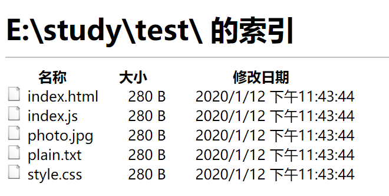

遗留问题：这样的一个获取文件目录还只是获取了一层，对应的文件夹与文件还是有区别的，以及时间和大小依旧没有正确的获取，可自行尝试实现。

## art-template

官方文档：http://aui.github.io/art-template/zh-cn/docs/api.html

### 介绍

art-template 是一个简约、超快的**模板引擎**。

它采用作用域预声明的技术来优化模板渲染速度，从而获得接近 JavaScript 极限的运行性能，并且同时支持 NodeJS 和浏览器。[在线速度测试](http://aui.github.io/art-template/rendering-test/)。

#### 特性

1. 拥有接近 JavaScript 渲染极限的的性能
2. 调试友好：语法、运行时错误日志精确到模板所在行；支持在模板文件上打断点（Webpack Loader）
3. 支持 Express、Koa、Webpack
4. 支持模板继承与子模板
5. 浏览器版本仅 6KB 大小

### 安装

在相应要使用的目录输入以下命令

```shell
npm install art-template --save
```


### 语法

```html
{{}}
```

```html
{{each 数组}}
	<li>{{ $value }}</li>
{{/each}}
```

> 引入联想
>
> JavaScript中的 forEach 和 jQuery  中的 each 方法区别
>
> - forEach 是 ECMAScript 5 中的一种数组遍历的函数，是JavaScript 原生支持的遍历方法。`[].forEach(function(item, index){})`，Array.prototype 原型上具有的方法。但是对于ie8及以下版本不支持。
>
> - jQuery 中使用方式是 `$.each(数组, function(index, item){})` 和 `$('div').each(function(index, item){})`。一般用于遍历 jQuery  选择器选择到的伪数组实例对象。相对于 forEach 中的回调函数，参数相反。高版本 jQuery 不支持 ie8 及以下版本
>   - 伪对象是对象
>   - 对象的原型链中没有 forEach
>   - 对象的原型链是 Object.prototype
>   - jQuery 中获取伪对象后，原型链上具有each方法
>   - jQuery 不是专门遍历 jQuery 元素的，但是可以做到。
>     - 方便的遍历 jQuery 元素
>     - 可以在不兼容forEach 的低版本浏览器中使用 JQuery 中的 each 方法。
>
> 在 jQuery 中使用 forEach 
>
> - `[].slice.call($('div')).forEach(function(item{}))`
>
> 

### 在浏览器中使用

```html
<!DOCTYPE html>
<html lang="en">
<head>
    <meta charset="UTF-8">
    <title>01-在浏览器中使用art-template</title>
</head>
<body>
    <!-- 在浏览器中引入lib/template-web.js文件，注意：模板引擎不关心字符串内容，只关心模板标记语法，比如{{}}，{{}}被称之为mustache语法，八字符语法-->
    <script src="node_modules/art-template/lib/template-web.js"></script>
    <!-- 将script的type类型规定为text/template，id为自定义 -->
    <!-- 使用{{ }} 来替换相关数据 -->
    <script type="text/template" id="tpl">
        hello {{ name }}
    </script>
    <script>
        //为对应的script绑定模板，添加对应的数据。
        var ret = template('tpl', {
            name: 'Jack'
        });
        console.log(ret);
    </script>
</body>
</html>
```

另外，即使在模板引擎中使用标签也会被当做是普通的字符串，例如以下

```html
<p>hello {{ name }}</p>
```

最终打印结果

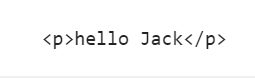

### 在Node.js中使用

1. 下载安装：`npm install art-template --save`
2. 在需要的文件模块中加载 `art-template`
   1. 使用`require` 方法加载：`require('art-template')`
3. 查看相关文档中的AIP使用

```js
// 加载相关模块，使用require('art-template')
var template = require('art-template');

// 定义要替换的字符串
var str = `
    <!DOCTYPE html>
    <html lang="en">
    <head>
        <meta charset="UTF-8">
        <title>02-在Node中使用art-template</title>
    </head>
    <body>
        <p>hello {{ name }}</p>
    </body>
    </html>
`;

// 使用AIP，render
var result = template.render(str, {
    name: 'Jack'
});
console.log(result);
```

打印结果

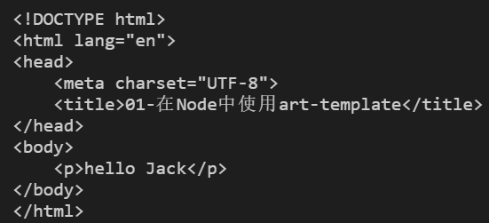

既然它可以处理解析字符串，那么我们就可以读取一个文件进行模板引擎的替换了

编写一个文件tpl.html

```html
<!DOCTYPE html>
<html lang="en">

<head>
    <meta charset="UTF-8">
    <title>03-在Node中巧妙使用art-template</title>
</head>

<body>
    <p>hello {{ name }}</p>
</body>

</html>
```

在js中使用`fs`核心模块去读取，与上述效果相同

```javascript
var template = require('art-template');
var fs = require('fs');

fs.readFile('./tpl.html', function (error, data) {
    if (error) return console.log('读取文件失败！');

    // 使用AIP，render
    var result = template.render(data.toString(), {
        name: 'Jack'
    });
    console.log(result);
})
```

注意：render接收的是字符串类型的数据，因此需要将读取到的二进制数据转化成字符串类型的数据。

### 运用模板引擎

在之前的Apache-目录列表中，我们将之替换成使用模板引擎来实现，在需要替换的地方使用{{}}即可，所获取的文件不是直接给客户端，而是经过后端处理后再给客户端的。

在template.html中写入模板

```html
<!DOCTYPE html>
<html lang="en">

<head>
  <meta charset="UTF-8">
  <meta name="viewport" content="width=device-width, initial-scale=1.0">
  <meta http-equiv="X-UA-Compatible" content="ie=edge">
  <title>{{ title }}</title>
  <style>
    /* 样式省略 */
  </style>
</head>

<body>
  <h1 id="header">E:\study\test\ 的索引</h1>
  <table>
    <thead>
      <tr class="header" id="theader">
        <th id="nameColumnHeader" tabindex="0" role="button">名称</th>
        <th id="sizeColumnHeader" class="detailsColumn" tabindex="0" role="button">
          大小
        </th>
        <th id="dateColumnHeader" class="detailsColumn" tabindex="0" role="button">
          修改日期
        </th>
      </tr>
    </thead>
    <tbody id="tbody">
      {{each filesObj}}
      <tr>
        <td data-value="index.html"><a class="icon {{$value.type}}" draggable="true"
            href="#">{{$value.name}}</a></td>
        <td class="detailsColumn" data-value="280">{{$value.size}}</td>
        <td class="detailsColumn" data-value="1578843824">{{$value.mtime}}</td>
      </tr>
      {{/each}}
    </tbody>
  </table>
</body>

</html>
```

在node后台中将数据进行转换并替换

```javascript
var http = require('http');
var fs = require('fs');
var template = require('art-template');

var server = http.createServer()
var wwwDir = 'E:/study/test/'; //这里填入默认路径
server.on('request', function (req, res) {
    fs.readFile('./template.html', function (err, data) {
        if (err) return console.log('文件不存在');

        fs.readdir(wwwDir, function (err, files) {
            if (err) {
                return console.log('目录不存在');
            }
            console.log(files);
            let filesObj = [];
            for (let i = 0; i < files.length; i++) {
                var stat = fs.lstatSync(wwwDir + files[i]);
                var is_direc = stat.isDirectory();
                var size = (stat.size / 1024).toFixed(2) + "KB";
                var dtime = formatDate(stat.mtimeMs);
                if (is_direc) {
                    filesObj[i] = {
                        type: 'dir',
                        name: files[i],
                        size: size,
                        mtime: dtime
                    }
                } else {
                    filesObj[i] = {
                        type: 'file',
                        name: files[i],
                        size: size,
                        mtime: dtime
                    }
                }
            }
            console.log(filesObj)
            var ret = template.render(data.toString(), {
                filesObj: filesObj
            })
            res.end(ret);
        })
    })
}).listen(3000, function (error) {
    if (error) return console.log('服务器开启失败');
    console.log('服务器开启成功，可以通过 http://127.0.0.1:3000 进行访问');
})

function formatDate(shijianchuo) {
    var time = new Date(shijianchuo); 
    var y = time.getFullYear();
    var m = time.getMonth() + 1;
    var d = time.getDate();
    var h = time.getHours();
    var mm = time.getMinutes();
    var s = time.getSeconds();
    return y + '/' + isZero(m) + '/' + isZero(d) + ' ' + isZero(h) + ':' + isZero(mm) + ':' + isZero(s);
}
function isZero(m) {
    return m < 10 ? '0' + m : m
}

```

最终效果

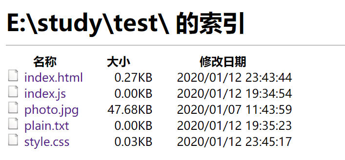

>  本节小结：

- 其实Node中的模板引擎本质上是字符串替换
- Node中的实现的模板引擎是后端渲染的一种技术

## 两种渲染方式

由于早期的网站都是简单，没有复杂逻辑的页面，这些页面都是由后端直接处理后将html进行拼接后，把完整的html文件发送给前端，而前端要做的事情就是将他们解析并展现出来，这个过程也就是服务器渲染。而随着页面的复杂化，前端不仅仅只是展示一些普通的页面了，可能还需要添加一些复杂的组件，或者是多功能的事件，还有一个重要的原因就是，随着Ajax的兴起，更多的开发者喜欢这种前后分离的开发模式，就是后端不是直接提供完整的html页面了，而是将一些数据发送给前端，让前端去自行拼接起来，然后再展示到浏览器中，这就是客户端渲染。

为了更好的理解这两种渲染方式，我们引入三个专有名词：**SPA、SEO、SSR**

- **SPA**（single page application） 单页面应用，是前后端分离时提出的一种解决方案。
   优点：页面之间切换快；减少了服务器压力；
   缺点：首屏打开速度慢，不利于 SEO 搜索引擎优化。
- **SEO**（search engine optimization）搜索引擎优化，利用搜索引擎的规则提高网站在有关搜索引擎内的自然排名。
   我们之前说 SPA 单页面应用，通过 ajax 获取数据，这就难保证我们的页面能被搜索引擎收到。并且有一些搜索引擎不支持的 js 和通过 ajax 获取的数据，那就更不用提 SEO 了，为解决这个问题，SSR 就能够解决。
- **SSR** （server side rendering）服务端渲染，SSR 的出现一定程度上解决了 SPA 首屏慢的问题，又极大的减少了普通 SPA 对于 SEO 的不利影响。


### 服务器渲染和客户端渲染的区别

两者的本质区别就是：将文件交付给谁进行拼接处理，如果是在服务端进行处理后的数据返回给客户端的就是服务器渲染，如果是客户端接收到数据，然后进行处理的就是客户端渲染。

示例：

在浏览器中查看一个页面的源代码，如果页面中的数据能够在源代码中查找到，那么就是服务器渲染过来的，如果查找不到，那么就是客户端动态加载的。

### SSR （server side rendering）服务端渲染

服务端在返回 html 之前，在特定的区域，符号里用数据填充，再给客户端，客户端只负责解析 HTML 。

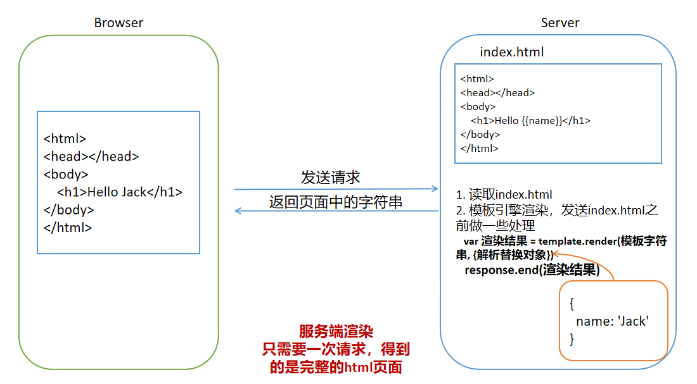

**优点：**

1. 前端渲染所要耗时少。因为后端拼接完了html，浏览器只需要直接渲染出来。
2. 有利于SEO搜索引擎优化。因为在后端提供了完整的html页面，所以爬虫更容易爬取获得信息。
3. 无需占用客户端资源。即解析模板的工作完全交由后端来做，客户端只要解析标准的html页面即可，这样对于客户端的资源占用更少，尤其是移动端，也可以更省电。

**缺点：**

1. 不利于前后端分离，开发效率低。使用服务器端渲染，则无法进行分工合作，则对于前端复杂度高的项目，不利于项目高效开发。另外，如果是服务器端渲染，则前端一般就是写一个静态html文件，然后后端再修改为模板，这样是非常低效的，并且还常常需要前后端共同完成修改的动作； 或者是前端直接完成html模板，然后交由后端。另外，如果后端改了模板，前端还需要根据改动的模板再调节css，这样使得前后端联调的时间增加。
2. 占用服务器端资源。即服务器端完成html模板的解析，如果请求较多，会对服务器造成一定的访问压力，这里的所有事情都交付给了服务器。

### 客户端渲染

html 仅仅作为静态文件，客户端端在请求时，服务端不做任何处理，直接以原文件的形式返回给客户端客户端，然后根据 html 上的 JavaScript，生成 DOM 插入 html。

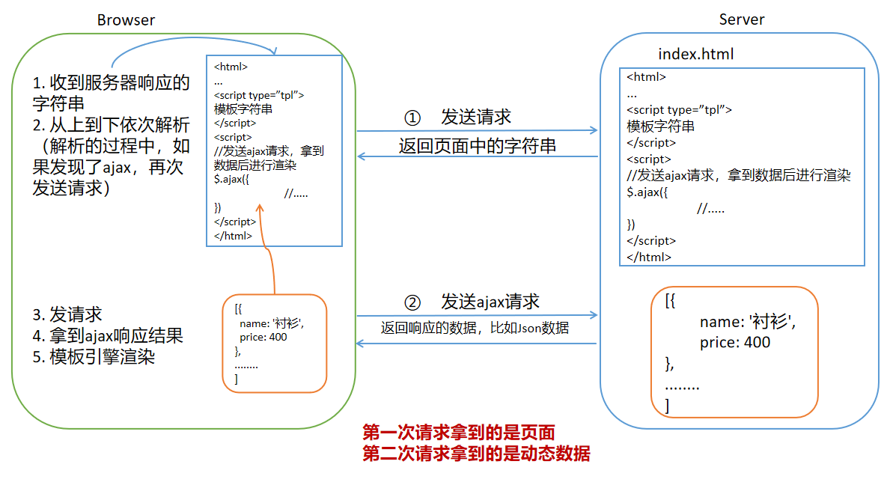

**优点：**

1. 前后端分离。前端专注于UI，后端专注于api开发。
2. 体验更好。比如我们使用异步方式获取数据，不影响用户的正常操作。首页面显示快。

**缺点：**

1. 前端响应较慢。如果是客户端渲染，前端还要进行拼接字符串的过程，需要耗费额外的时间，不如服务器端渲染速度快。
2. 不利于SEO。目前比如百度、谷歌的爬虫对于SPA都是不认的，只是记录了一个页面，所以SEO很差。因为服务器端可能没有保存完整的html，而是前端通过js进行dom的拼接，那么爬虫无法爬取信息。 除非搜索引擎的seo可以增加对于JavaScript的爬取能力，这才能保证seo。

### 如何选择？

选择服务器渲染还是客户端渲染都是看指定的业务场景进行的。企业级网站，一些电商网站，主要功能是展示而没有复杂的交互，并且需要良好的SEO，比如京东的商品标题和内容则需要良号的SEO，则这时我们就需要使用服务器端渲染；而类似后台管理或者是个人隐私页面，交互性比较强，不需要seo的考虑，那么就可以使用客户端渲染。
 另外，具体使用何种渲染方法并不是绝对的，比如现在一些网站采用了首屏服务器端渲染，即对于用户最开始打开的那个页面采用的是服务器端渲染，这样就保证了渲染速度，而其他的页面采用客户端渲染，这样就完成了前后端分离。又比如电商网站是有两者的结合而成，比如京东的商品列表就采用了服务器渲染，目的是为了SEO搜索引擎优化，而它的商品评论列表为了用户的体验，而且不需要SEO搜索引擎优化，就采用了客户端渲染。


## 实现简易留言板feedback

### 前言

浏览器收到响应内容后，就要开始从上到下依次解析，当在解析的过程中，如果发现：

- link
- script
- img
- iframe
- video
- audio
- ......

带有src或者href（link）属性标签（具有外链的资源）的时候，浏览器会自动对这些资源发起新的请求，如果我们只对一个页面资源进行处理的话，index.html中的外链资源则不可以请求到

例如以下

```html
<!DOCTYPE html>
<html lang="en">
<head>
    <meta charset="UTF-8">
    <meta name="viewport" content="width=device-width, initial-scale=1.0">
    <meta http-equiv="X-UA-Compatible" content="ie=edge">
    <title>留言板</title>
    <link rel="stylesheet" href="../node_modules/bootstrap/css/bootstrap.css">
    <link rel="stylesheet" href="css/main.css">
</head>
<body>
    你好
    
    <script src="js/main.js"></script>
</body>
</html>
```

```javascript
var http = require('http');
var fs = require('fs');
//简写方式
http.createServer(function(req, res){
    var url = req.url;
    if(url === '/'){
        fs.readFile('./views/index.html', function(err, data){
            if(err) return res.end('404 Not Found!');
            res.end(data);
        })
    }
}).listen(3000, function(error){
    if(error) return console.log('error!');
    console.log('running....');
})
```

所显示的页面就会一直处在挂起的状态，其他的资源得不到加载权限。

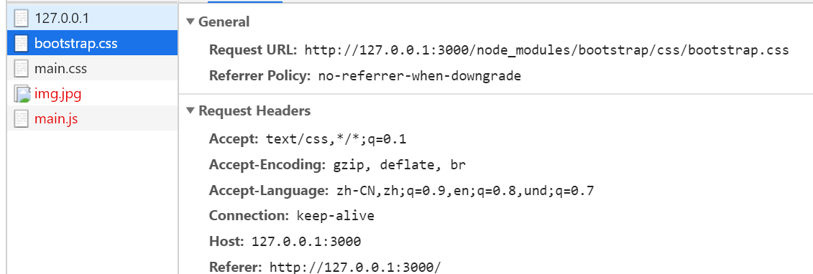

### 处理网站中的静态资源

为了方便统一处理资源，我们将所有的静态资源都放到public目录中，如以下的目录结构，目的是开放指定资源，有服务端进行控制。而相对于Apache来说，Apache会将所有资源暴露出来，而比较严密的Node则可以得到控制。


当访问到public目录下的资源时，就可以统一处理那些需要加载的资源了。通过`url.indexOf('/public/') === 0`进行判断，所请求的方式是：

- /public/css/main.css
- /publis/js/main.css
- /publis/imgs/logo.png
- /public/lib/jquery.js

```html
<!DOCTYPE html>
<html lang="en">
<head>
    <meta charset="UTF-8">
    <meta name="viewport" content="width=device-width, initial-scale=1.0">
    <meta http-equiv="X-UA-Compatible" content="ie=edge">
    <title>留言板</title>
    <!-- 
		注意：在服务器中，文件中的路径不适用相对路径
		因为这时候的所有文件资源都通过url标识来进行获取
		在服务器中开放了  /public/ 目录
		所以这里的请求路径都写成  /public/.....
	-->
    <link rel="stylesheet" href="/public/lib/jquery.js">
    <link rel="stylesheet" href="/public/css/main.css">
</head>
<body>
    你好
    
    <script src="/public/js/main.js"></script>
</body>
</html>
```

注意：

- 在服务器中，文件中的路径不适用相对路径

- 因为这时候的所有文件资源都通过url标识来进行获取

- 在服务器中开放了  `/public/` 目录

- 所以这里的请求路径都写成  `/public/.....`

- `/`  指的是url根路径的意思

- 发送请求时，浏览器真正发送请求的时候最终会在http://127.0.0.1:3000 后面进行拼接。例如Request URL: 

  http://127.0.0.1:3000/public/css/main.css

```javascript
var http = require('http');
var fs = require('fs');

http.createServer(function(req, res){
    var url = req.url;
    if(url === '/'){
        fs.readFile('./views/index.html', function(err, data){
            if(err) return res.end('404 Not Found!');
            res.end(data);
        })
    }else if(url.indexOf('/public/') === 0){
        // 当访问到public目录下的资源时，就可以统一处理那些需要加载的资源了。通过`url.indexOf('/public/') === 0`进行判断，所请求的方式是：

        //  /public/css/main.css
        //  /publis/js/main.css
        //  /publis/imgs/logo.png
        //  /public/lib/jquery.js
        // 使用readFile时必须加上  .  
        fs.readFile('.' + url, function(err, data){
            if(err) return res.end('404 Not Found!');
            res.end(data)
        });
    }else{
        fs.readFile('./views/404.html',function(err, data){
            if(err) return res.end('404 Not Found!');
            res.end(data);
        })
    }
}).listen(3000, function(error){
    if(error) return console.log('error!');
    console.log('running....');
})
```

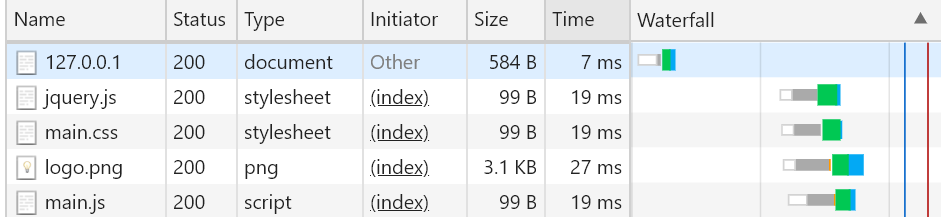

### 渲染首页

在需要请求的地方，我们将之写入url地址，写入基本样式，并使用art-template模板引擎

```html
<!DOCTYPE html>
<html lang="en">
<head>
    <meta charset="UTF-8">
    <meta name="viewport" content="width=device-width, initial-scale=1.0">
    <meta http-equiv="X-UA-Compatible" content="ie=edge">
    <title>留言板</title>
    <link rel="stylesheet" href="/public/lib/bootstrap/css/bootstrap.css">
</head>
<body>
    <div class="header container">
        <div class="page-header">
            <h1>留言列表  <small>反馈留言板</small></h1>
            <a class="btn btn-success" href="/post">发表留言</a>
        </div>
    </div>
    <div class="comments container">
        <ul class="list-group">
            {{each comments}}
            <li class="list-group-item">{{$value.name}}说：{{$value.message}}<span class="pull-right">{{$value.dateTime}}</span></li>
            {{/each}}
        </ul>
    </div>
</body>
</html>
```

### 功能处理

在app.js中判断各类url的情况处理

- 首页：路径为 `/`
  - 读取用户留言信息user.json文件，将之赋予comments数组
  - 读取index.html文件，并将user.json文件的数据替换并展现到页面中
- 以 `/public/` 开头的url
  - 读取相应路径的文件，并返回结果
- 发表留言页面： 路径为`/post`
  - 读取views下的post.html，并返回页面
- 带有参数的提交  `/commit`
  - 首先将url中的query对象获取
  - 设置当前用户信息和留言内容
  - 将新的数组对象写入user.json文件当中
  - 向客户端返回状态码302（表示重定向）
  - 设置头部信息中的Location到根路径`/`，即可返回到首页
  - 返回结束，看到首页新留言列表
- 其余请求路径
  - 输出404.html页面


>  301表示永久重定向  浏览器会记住上一次的行为
>
> - 比如需要访问 a.com 网站被重定向到了 b.com
> - 后续对于输入 a.com 时浏览器不会请求a.com了
> - 直接跳转到b.com网站。
>
> 302 表示临时性重定向  而浏览器不记忆
>
> - 比如需要访问 a.com 网站被重定向到了 b.com
> - 后续对于输入 a.com 时浏览器先请求a.com
> - 如果需要还需要跳转，则跳转。

另外，使用url模块可以使一个url进行解析

```javascript
var reqUrl = 'http://127.0.0.1:3000?name=张三&message=大家新年好啊！';
console.log(url.parse(reqUrl, true));
```

结果会被解析成

```bash
Url {
  protocol: 'http:',
  slashes: true,
  auth: null,
  host: '127.0.0.1:3000',
  port: '3000',
  hostname: '127.0.0.1',
  hash: null,
  search: '?name=张三&message=大家新年好啊！',
  query: [Object: null prototype] { name: '张三', message: '大家新年好啊！' },
  pathname: '/',
  path: '/?name=张三&message=大家新年好啊！',
  href: 'http://127.0.0.1:3000/?name=张三&message=大家新年好啊！'
}
```

因此其中的query可以获取到传入的参数。（与split方法类似）。

完整app.js

```javascript
var http = require('http');
var fs = require('fs');
var url = require('url');
var template = require('art-template');

var comments = [];

http.createServer(function (req, res) {
    var parseObj = url.parse(req.url, true);
    var pathName = parseObj.pathname;
    if (pathName === '/') {
        fs.readFile('./views/user.json', function (err, data) {
            if (err) return console.log('error');
            var data = JSON.parse(data);
            comments = data;
        })
        fs.readFile('./views/index.html', function (err, data) {
            if (err) return res.end('404 Not Found!');
            var result = template.render(data.toString(), {
                comments: comments
            })
            res.end(result);
        })
    } else if (pathName.indexOf('/public/') === 0) {
        fs.readFile('.' + pathName, function (err, data) {
            if (err) return res.end('404 Not Found!');
            res.end(data);
        });
    } else if (pathName === '/post') {
        fs.readFile('./views/post.html', function (err, data) {
            if (err) return res.end('404 Not Found!');
            res.end(data);
        })
    } else if (pathName === '/commit') {
        var comment = parseObj.query;
        comment.dateTime = formatDate(new Date());
        comments.push(comment);
        var commentStr = JSON.stringify(comments);
        fs.writeFile('./views/user.json', commentStr, function (err) {
            if (err) return console.log('error!');
            console.log('记录成功！');
        })
        res.statusCode = 302;
        res.setHeader('Location', '/');
        res.end();
    } else {
        fs.readFile('./views/404.html', function (err, data) {
            if (err) return res.end('404 Not Found!');
            res.end(data);
        })
    }
}).listen(3000, function (error) {
    if (error) return console.log('error!');
    console.log('running....');
})

function formatDate(date) {

    var y = date.getFullYear();
    var m = date.getMonth() + 1;
    var d = date.getDate();
    var h = date.getHours();
    var mm = date.getMinutes();
    var s = date.getSeconds();
    return y + '/' + isZero(m) + '/' + isZero(d) + ' ' + isZero(h) + ':' + isZero(mm) + ':' + isZero(s);
}
function isZero(m) {
    return m < 10 ? '0' + m : m
}
```

完整post页面

```html
<!DOCTYPE html>
<html lang="en">
<head>
    <meta charset="UTF-8">
    <meta name="viewport" content="width=device-width, initial-scale=1.0">
    <meta http-equiv="X-UA-Compatible" content="ie=edge">
    <title>发表留言</title>
    <link rel="stylesheet" href="/public/lib/bootstrap/css/bootstrap.css">
</head>
<body>
    <div class="header container">
        <div class="page-header">
            <h1><a class="btn btn-success" href="/">首页</a><small>发表评论</small></h1>
        </div>
    </div>
    <div class="comments container">
        <form action="/commit" method="GET">
            <div class="form-group">
                <label for="input_name">你的名字</label>
                <input type="text" class="form-control" required minlength="2" maxlength="10" id="input_name" name="name" placeholder="输入你的名字">
            </div>
            <div class="form-group">
                <label for="textarea_message">留言内容</label>
                <textarea type="text" class="form-control" required minlength="5" maxlength="520" id="textarea_message" name="message"></textarea>
            </div>
            <button type="submit" class="btn btn-default">发表</button>
        </form>
    </div>
</body>
</html>
```

最终显示的效果

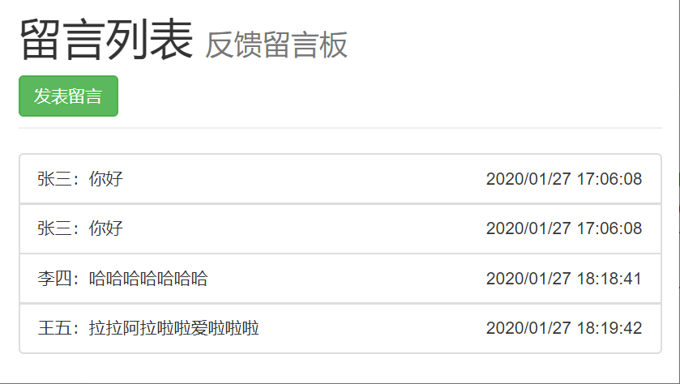

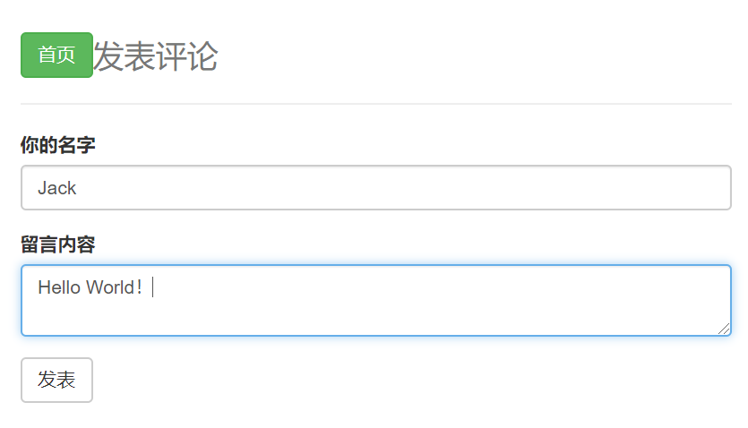

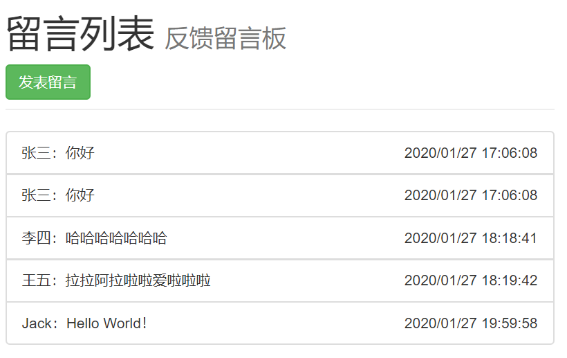

## Node中的模块系统

PHP 中为什么就可以直接 `require`、`include` 因为 PHP 当初在设计的时候就加入了这个功能

  + PHP 这门语言天生就支持
  + 模块作用域
  + 可以使用 API 来进行文件与文件之间的依赖加载
  + 在 Node 这个环境中对 JavaScript 进行了特殊的模块化支持 CommonJS

JavaScript 天生不支持模块化
* require
* exports
* Node.js 才有的

在浏览器中也可以像在 Node 中的模块一样来进行编程
* `<script>` 标签来引用加载，而且你还必须考虑加载的顺序问题
* require.js 第三方库 AMD
* sea.js     第三方库 CMD

无论是 CommonJS、AMD、CMD、UMD、EcmaScript 6 Modules 官方规范
* 都是为了解决 JavaScript 的模块化问题
* CommonJS、AMD、CMD 都是民间搞出来的
* EcmaScript 是官方规范定义
* 官方看民间都在乱搞，开发人员为了在不同的环境使用不同的 JavaScript 模块化解决方案
* 所以 EcmaScript 在 2015 年发布了 EcmaScript 2016 官方标准
* 其中就包含了官方对 JavaScript 模块化的支持
* 也就是说语言天生就支持了
* 但是虽然标准已经发布了，但是很多 JavaScript 运行换将还不支持
* Node 也是只在 8.5 版本之后才对 EcmaScript 6 module 进行了支持
* 后面学 Vue 的时候会去学习
* less 编译器 > css
* EcmaScript 6 -> 编译器 -> EcmaScript 5
* 目前的前端情况都是使用很多新技术，然后利用编译器工具打包可以在低版本浏览器运行。
* 使用新技术的目的就是为了提高效率，增加可维护性

> 可阅读书籍：
>
> - 《深入浅出Nodejs》 中的模块系统
>
> - 其他： https://www.infoq.cn/article/nodejs-module-mechanism/


之前我们提到了，自定义模块的加载，我们可以通过require()方法进行引入，通过exports进行接口对象的导出，exports是一个对象，我们可以通过多次为这个对象添加成员实现对外导出多个内部成员。

### 什么是模块化？

- 文件作用域
- 通信规则
  - 加载（比如 require）
  - 导出

### CommonJs模块规范

在Node中的JavaScript有一个重要的概念叫做模块系统

- 模块作用域
- 使用require 方法来加载模块

- 使用 exports 接口对象来导出模块中的成员

#### 加载模块 `require`

语法

```javascript
var 自定义模块名称 = require('模块');
```

两个作用：

1. 执行被夹在模块中的代码
2. 拿到被夹在模块中的 `exports` 导出接口对象

#### 导出对象`exports`

- Node中是模块作用域，默认文件中的所有成员只在当前文件模块中有效
- 对于希望可以被其它模块访问的成员，我们就需要把这些公开的成员都挂在到 `exports`接口对象中

导出多个成员（对象）：

```javascript
exports.a = 123;
exports.b = 'abc';
exports.c = function(){
    console.log('c');
};
exports.d = {
    name: 'Jack'
};
```

导出单个成员（拿到的就是函数、字符串或者是数组等等）：

而现在所得到的是exports这个对象，如果需要加载得到的就是想要的内容，那么直接赋值是不能实现的。应该使用的是以下的方式，注意：后者导出的内容会覆盖

```javascript
function add(x, y){
    return x + y;
}

// exports.add = add;
// exports是一个对象
// 我们可以通过多次为这个对象添加成员实现对外导出多个内部成员

// 如果希望我们在外部直接拿到的不是一个对象，可以是
// 方法
// 字符串
// 数字
// 数组

// 如果一个模块需要直接导出某个成员，而非挂载的方式，这时候使用以下方法实现
module.exports = add;

module.exports = 'Jack';
```

rAdd则是得到对应的外部成员

```javascript
var rAdd = require('./b.js');
console.log(rAdd(1,2));
```

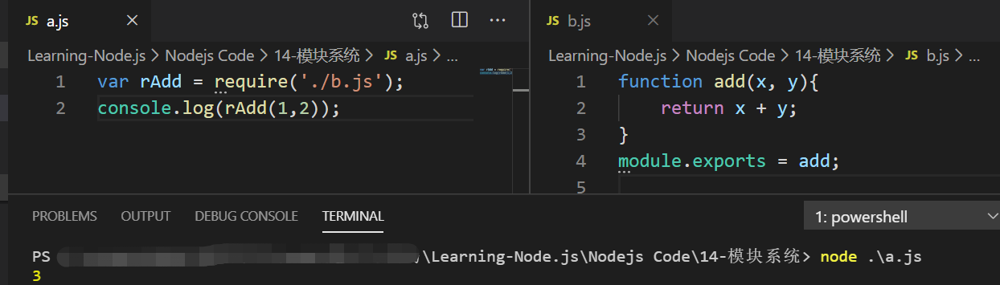

也可通过这种方法导出多个对象

```javascript
module.exports = {
    name: 'Jack',
    add: function(x, y){
        return x + y;
    }
};
```

#### 原理说明（exports和module.exports的区别）

`exports`是`module.exports`的一个引用，为了方便导出，Node中使用`module.exports`进行导出的话，太过冗余，所以使用`exports`来简化写法。引用固然不可以直接赋值进行导出，因为直接赋值则最终的成员就不在`module.exports`上。模块中最终return的是`module.exports`而不是`exports`。

```javascript
module.exports.name = 'Jack';
module.exports.add = function(x, y){
    return x + y;
};

// 底层内容
var module = {
    exports: {
        name: 'Jack',
        add: function(x, y){
            return x + y;
        }
    }
}

// 模块中有这么一句
var exports = module.exports;
```


```javascript
console.log(exports === module.exports) //=>true

exports.foo = 'bar';
//等价于
module.exports.foo = 'bar';
```


> exports赋值后exports无效，之前在exports身上添加的成员有效，但不影响module.exports，module.exports赋值则后续的导出无效。
>
> ```javascript
> exports.name = 'Jack';
> exports = {};
> exports.add = function(x, y){return x + y;};  //导出无效
> ```
>
> ```javascript
> module.exports.name = 'Jack';  //无效
> function add(x, y){return x + y;};
> module.exports = add;
> exports.name = 'Jack'; //引用断开，无效
> ```

#### require 方法加载规则

- 核心模块
  - 模块名
- 第三方模块
  - 模块名
- 自定义模块
  - 路径
    - `./xxx`（当前路径）
    - `../xxx`（上一级路径）
    - `/xxx`（当前文件模块所属磁盘根路径）
    - `C:/xxx`（绝对路径）

首先会从缓存中加载，观察一下例子，有三个文件，main.js ， a.js 和 b.js

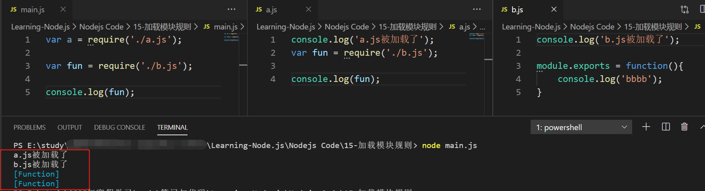

在main.js中，对a 和 b 分别进行了加载， 而 a 中也对 b 进行了加载，但是只显示了一次  `b.js被加载了`

说明由于在 a 中已经对 b 进行加载过了，所以在 main.js 中不会重复去加载 b 了，只会去拿到 b 中的接口对象，但不会重复执行里面的代码。这就是**优先从缓存中加载**，这样做的好处就是避免重复加载，提高模块加载效率。

#### 第三方模块

Node中提供了三种模块：

- 具名的核心模块，例如 fs 、 http、os...
- 用户编写的文件模块，注意：相对路径必须加上  `./`
- 第三方模块，可通过`npm install xxx --save`进行下载，比如art-template。

其中的第三方模块的加载原理是这样的，以art-template举例

- 先找到当前文件所处目录中的 node_modules 目录
- node_modules/art-template
- node_modules/art-template/package.json 文件
- node_modules/art-template/package.json 文件中的 main 属性（main属性没有指定，则去默认的 index.js 文件）
- main 属性中记录了 art-template 的入口模块
- 然后加载使用这个第三方包（实际上就是加载文件）

（如果以上条件都不成立，则进入上一级目录查找，如果还是没有，一直往上，如果当前磁盘根路径目录都没有找到，最后就会报错。所以开发过程中，我们会将node_modules 目录放在根目录，让每一个模块都能够访问到）

#### 模块查找机制

- 优先从缓存加载
- 核心模块
- 路径形式的文件模块
- 第三方模块

## 包管理

### npm

我们通常会使用 npm 进行包的加载。

- npm网站： npmjs.com（我们下载的东西都是从这里下载的）

npm是一个命令行工具，随着node的暗转，就自动安装了npm

#### 常用命令

> - npm init
>   - npm init -y 可以跳转导向，快速生成
>
> - npm install
>   - 一次性把 dependencies 选项中的依赖项全部安装
>   - npm  i  （简写）
>
> - npm install xxx
>   - 只下载
>   - npm  i  xxx（简写）
>
> - npm install xxx --save（或者  npm install --save xxx）
>   - 下载并且保存依赖项（package-lock.json文件的dependencies 选项）
>   - npm i -S xxx（简写）
> - npm uninstall xxx
>   - 删除包，依赖项不变
>   - npm un xxx（缩写）
> - npm uninstall xxx --save（或者 npm uninstall --save xxx）
>   - 删除包，并删除依赖项
>   - npm un -S xxx（简写）
> - npm --help
>   - 查看使用帮助
> - npm 命令 --help
>   - 查看指定命令 的使用帮助
>
> .....
>
> .....
>
> 网上有很多相关的技术总结文章，这里就不多说了，也可通过 `npm --help` 进行查询帮助。

#### npm速度慢

有时候，我们在下载的时候会特别慢，因为npm存储包文件的服务器是在国外的，所以我们可以下载安装淘宝的cnpm，这时候就会使用淘宝的服务器进行下载，速度会快一些。淘宝镜像：http://npm.taobao.org/。

```bash
npm install --global cnpm
```

### package.json和package-lock.json

在使用npm的时候，我们注意到后面有一个 `--save` ，如果我们在开发的过程中，突然 mode_modules 包不见了，这时候不知道我们的项目到底依赖了哪些包，这时候，`--save`的作用就出来了，它在下载的时候，会自动地在当前目录下生成一个 `package.json` 和 `package-lock.json` 文件 ，就是包文件描述文件

```bash
npm install -y
npm install jquery --save
```

`package.json` 文件中就会有一个`dependencies` 的属性，它的意思是依赖，表示我们导入了哪些重要的文件包。其中就有jquery的相关信息。

```javascript
"dependencies": {
    "jquery": "^3.4.11"
}
```

package-lock.json 这个文件保存了 node_modules 中的所有包信息（包括版本、下载地址等等）

## Express
### 介绍

Fast, unopinionated, minimalist web framework for [Node.js](https://nodejs.org/en/) （用于Node.js的快速、开源的、极简web框架）

官方网站： http://expressjs.com/

因为原生 http 在某些方面表现不足，以无法应对我们的开发需求，所以我们就需要使用框架来加快我们的开发效率。

- Express就是第三方 Web 开发框架
- 高度封装了 http 模块
- 提高编码效率，更加专注于业务，而非底层细节。

### 安装

假设您已经安装了Node.js），那么创建一个目录来保存您的应用程序，并使其成为您的工作目录。

```sh
mkdir myapp
cd myapp
```

使用`npm init`命令为应用程序创建“package.json”文件。有关“package.json”如何工作的更多信息，请参见[npm的package.json处理的细节](https://docs.npmjs.com/files/package.json)。

```sh
npm init
```

此命令提示您输入许多内容，例如应用程序的名称和版本。现在，您只需单击RETURN接受大多数默认值，但以下情况除外：

```sh
entry point: (index.js)
```

输入`app.js`，或者输入主文件名。如果希望它是`index.js`，请按RETURN接受建议的默认文件名。

现在在`myapp`目录中安装Express并将其保存在依赖项列表中。例如：

```sh
npm install express --save
```

要临时安装Express而不将其添加到依赖项列表中，可执行以下操作：

```sh
npm install express --no-save
```

### Hello World

app.js 中写入以下代码就可开启服务。

```javascript
const express = require('express')
const app = express()
const port = 3000

app.get('/', (req, res) => res.send('Hello World!'))

app.listen(port, () => console.log(`Example app listening on port ${port}!`))
```

其中有一个非常熟悉的语句

```javascript
app.get('/', (req, res) => res.send('Hello World!'));
```

这句话的意思是，当请求 `/`的时候，返回一个字符串： `Hello world`。

### 基本路由

路由器就是一张表，表里边有具体的映射关系

上述的get方法，可以提取成以下的结构：

```javascript
app
  .get('/', function(){})
  .get('/login', function(){})
  .post('/a', function(){})
  .post('/b', function(){})
```

路由组成部分：

- 请求方法
- 请求路径
- 请求处理

### 静态资源

通过以下方式将指定目录给开放出去。

```javascript
// 公开指定目录（建议使用这种形式，更符合语义）
app.use('/public/', express.static('./public/'));// 访问的路径是： http://127.0.0.1:3000/public/js/main.js  

// 可以省略第一个参数
app.use(express.static('public'));
app.use(express.static('./public/'));  // 访问的路径是： http://127.0.0.1:3000/js/main.js
```

可见在Express下变得很简单了。

### 在Express中使用art-template

- [art-template官方文档](https://github.com/aui/express-art-template)

#### 安装

```bash
npm install --save art-template
npm install --save express-art-template
```

#### 配置

```JavaScript
var express = require('express');
var app = express();
```

```javascript
// 参数 ‘art’，表示的是当渲染以 .art 结尾的文件的时候，使用 art-template 模板引擎
// express-art-template 是用来在 Express 中把 art-template 整合到 Express中
// express-art-template 依赖 art-template
app.engine('art', require('express-art-template'));
// render函数的默认路径
app.set('view options', {
    debug: process.env.NODE_ENV !== 'production'
});


// 当然我们可以换掉第一个参数
app.engine('html', require('express-art-template'));
```

#### 使用

```javascript
app.engine('html', require('express-art-template'));
app.get('/', function (req, res) {
    // 第一个参数不能磁轭路径，默认会去项目中的 views 目录查找该文件模块
    // views 放置的都是与视图有关的文件，可供渲染
    res.render('index.html', {
        title: 'Hello'
    });
});
```

### 使用Express重写留言板

#### 在Express获取 GET 提交的数据

在 Express 中内置了一个API，可以直接通过 `req.query` 来获取

```javascript
req.query
```


#### 在Express获取POST提交的数据

介于消息内容较大的问题，这里的留言信息应该使用 POST 请求比较合适，在Express 中没有内置获取表单 POST 请求体的API ，这时候需要借助第三方包： body-parser

##### 安装

```bash
npm install express body-parser --save
```

##### 运用

```javascript
const express = require('express');
var bodyParser = require('body-parser');
const app = express();
const port = 3000;

// 配置 body-parser 中间件（插件，专门用来解析表单 POST 请求体）
// parse application/x-www-form-urlencoded
app.use(bodyParser.urlencoded({ extended: false }));

// parse application/json
app.use(bodyParser.json());

app.post('/post', (req, res)=>{
    console.log(req.body)  //=>[Object: null prototype] { name: 'dsdds', message: 'ddddd' }
})

app.listen(port, function (error) {
    if (error) return console.log('error!');
    console.log('running....');
})
```

留言板app.js

```javascript
const express = require('express');
var bodyParser = require('body-parser');
const app = express();
const port = 3000;
var fs = require('fs');
app.engine('html', require('express-art-template'));

app.use('/public/', express.static('./public/'));
// parse application/x-www-form-urlencoded
app.use(bodyParser.urlencoded({ extended: false }));

// parse application/json
app.use(bodyParser.json());

var comments = [];
app.get('/', (req, res) => {
    fs.readFile('./views/user.json', function (err, data) {
        if (err) return console.log('error');
        var data = JSON.parse(data);
        comments = data;
    })
    res.render('index.html', {
        comments: comments
    });
})

app.get('/post', (req, res) => {
    res.render('post.html');
})

app.post('/post', (req, res)=>{
    var comment = req.body;  // 改为第三方包body-parser获取请求实体
    comment.dateTime = formatDate(new Date());
    comments.push(comment);
    var commentStr = JSON.stringify(comments);
    fs.writeFile('./views/user.json', commentStr, function (err) {
        if (err) return console.log('error!');
        console.log('记录成功！');
    })
    res.redirect('/');
})

app.listen(port, function (error) {
    if (error) return console.log('error!');
    console.log('running....');
})

function formatDate(date) {

    var y = date.getFullYear();
    var m = date.getMonth() + 1;
    var d = date.getDate();
    var h = date.getHours();
    var mm = date.getMinutes();
    var s = date.getSeconds();
    return y + '/' + isZero(m) + '/' + isZero(d) + ' ' + isZero(h) + ':' + isZero(mm) + ':' + isZero(s);
}
function isZero(m) {
    return m < 10 ? '0' + m : m
}
```


## 后台管理系统（增删改查）——CRUD by Express

### 前期准备

#### 安装配置

```bash
mkdir crud-express
cd crud-express/

npm init
Press ^C at any time to quit.
package name: (crud-express)
version: (1.0.0)
description: 增删改查crud-express
entry point: (index.js)
test command:
git repository:
keywords:
author:
license: (ISC)
About to write to ..\笔记与代码\Learning-Node.js\Nodejs Code\18-CRUD-express\crud-express\package.json:

{
  "name": "crud-express",
  "version": "1.0.0",
  "description": "增删改查crud-express",
  "main": "index.js",
  "scripts": {
    "test": "echo \"Error: no test specified\" && exit 1"
  },
  "author": "",
  "license": "ISC"
}

Is this OK? (yes) y

npm install express --save
npm install art-template --save
npm install express-art-template --save
npm install express body-parser --save
npm install bootstrap --save
npm install nodemon --save
```

网站实例： https://v3.bootcss.com/examples/dashboard/

改写index.html

```html
<!DOCTYPE html>
<html lang="zh-CN">
  <head>
    <meta charset="utf-8">
    <meta http-equiv="X-UA-Compatible" content="IE=edge">
    <meta name="viewport" content="width=device-width, initial-scale=1">
    <meta name="description" content="">
    <meta name="author" content="">
    <link rel="icon" href="../../favicon.ico">
    <title>学生管理系统</title>
    <!-- Bootstrap core CSS -->
    <link href="/node_modules/bootstrap/dist/css/bootstrap.min.css" rel="stylesheet">
    <!-- Custom styles for this template -->
    <link href="/public/css/main.css" rel="stylesheet">

  </head>
  <body>
      
    <nav class="navbar navbar-inverse navbar-fixed-top">
      <div class="container-fluid">
        <div class="navbar-header">
          <button type="button" class="navbar-toggle collapsed" data-toggle="collapse" data-target="#navbar" aria-expanded="false" aria-controls="navbar">
            <span class="sr-only">Toggle navigation</span>
            <span class="icon-bar"></span>
            <span class="icon-bar"></span>
            <span class="icon-bar"></span>
          </button>
          <a class="navbar-brand" href="#">学生管理系统</a>
        </div>
        <div id="navbar" class="navbar-collapse collapse">
          <ul class="nav navbar-nav navbar-right">
            <li><a href="#">仪表板</a></li>
            <li><a href="#">设置</a></li>
            <li><a href="#">简况</a></li>
            <li><a href="#">帮助</a></li>
          </ul>
          <form class="navbar-form navbar-right">
            <input type="text" class="form-control" placeholder="搜索...">
          </form>
        </div>
      </div>
    </nav>

    <div class="container-fluid">
      <div class="row">
        <div class="col-sm-3 col-md-2 sidebar">
          <ul class="nav nav-sidebar">
            <li class="active"><a href="#">概述 <span class="sr-only">(当前)</span></a></li>
            <li><a href="#">报告</a></li>
            <li><a href="#">分析</a></li>
            <li><a href="#">导出</a></li>
          </ul>
          <ul class="nav nav-sidebar">
            <li><a href="">导航栏</a></li>
            <li><a href="">Nav item again</a></li>
            <li><a href="">One more nav</a></li>
            <li><a href="">Another nav item</a></li>
            <li><a href="">More navigation</a></li>
          </ul>
          <ul class="nav nav-sidebar">
            <li><a href="">Nav item again</a></li>
            <li><a href="">One more nav</a></li>
            <li><a href="">Another nav item</a></li>
          </ul>
        </div>
        <div class="col-sm-9 col-sm-offset-3 col-md-10 col-md-offset-2 main">
          <h2 class="sub-header">学生信息</h2>
          <button class="btn btn-success">添加</button>
          <div class="table-responsive">
            <table class="table table-striped">
              <thead>
                <tr>
                  <th>序号</th>
                  <th>姓名</th>
                  <th>性别</th>
                  <th>年龄</th>
                  <th>爱好</th>
                </tr>
              </thead>
              <tbody>
                {{ each students}}
                    <tr>
                    <td>{{ $value.id }}</td>
                    <td>{{ $value.name }}</td>
                    <td>{{ $value.gender }}</td>
                    <td>{{ $value.age }}</td>
                    <td>{{ $value.hobbies }}</td>
                    </tr>
                {{ /each}}
              </tbody>
            </table>
          </div>
        </div>
      </div>
    </div>
    <script src="/node_modules/jquery/dist/jquery.js"></script>
    <script>window.jQuery || document.write('<script src="../../assets/js/vendor/jquery.min.js"><\/script>')</script>
    <script src="/node_modules/bootstrap/dist/js/bootstrap.min.js"></script>
    <!-- Just to make our placeholder images work. Don't actually copy the next line! -->
    <script src="/public/js/holder.min.js"></script>
    <!-- IE10 viewport hack for Surface/desktop Windows 8 bug -->
    <script src="/public/js/ie10-viewport-bug-workaround.js"></script>
  </body>
</html>

```

### 路由设计

| 请求方法 | 请求路径 | GET | PPST | 备注 |
| ---- | ---- | ---- | ---- | ---- |
| GET | /students |||渲染首页|
| GET | /students/new|||渲染添加学生页面|
| POST | /students/new ||name、gender、age、 hobbies|处理添加学生请求|
| GET | /students?id=xxx |id||渲染编辑页面|
| POST |/students/edit ||id、name、gender、age、hobbies|处理编辑请求|
| GET |/students/delete |id||处理删除请求|

### 路由模块的提取

#### router.js路由模块

- 处理路由
- 根据不同的请求方法 + 请求路径设置具体的请求函数

```javascript
/**
 * router.js
 */
// Express 提供了一个方式专门包装路由
const express = require('express');
// 创建一个路由容器
const router = express.Router();
const fs = require('fs');
const Student = require('./students');

// 把路由都挂在到 router 路由容器中
router.get('/students', (req, res) => {
    Student.find((err, students) => {
        //...
    })
})
router.get('/students/new', (req, res) => {
    res.render('new.html');
})
router.post('/students/new', (req, res) => {
    console.log(req.body)
    // ...
    // 1.获取表单数据
    // 2、处理
    //        将数据保存到students.json 文件中
    // 3、发送相应
    //     先读取文件，转成对象
    //     然后网对象中插入数据
    //     讲对象转为字符串
    //     将字符串再次写入文件
    Student.save(req.body, (err) => {
        if (err) return res.status(500).end('Server Error....');
        res.redirect('/students');
    })

})
router.get('/students/edit', (req, res) => {
    // 1、在客户端的列表页中处理链接问题（需要有 id 参数）
    // 2、获取要编辑的学生 id
    // 3、渲染编辑页面
    Student.findById(parseInt(req.query.id), (err, student)=>{
        if(err) return res.status(500).end('Server error....');
        res.render('edit.html',{
            student: student
        })
    })
})
router.post('/students/edit', (req, res) => {
    // 1、获取表单数据
    // 2、更新
    // 3、发送相应
    Student.update(req.body, (error)=>{
        if(error) return res.status(500).end('Server error....');
        res.redirect('/students');
    })
})
router.get('/students/delete', (req, res) => {
    Student.delete(parseInt(req.query.id), (err)=>{
        if(err) return res.status(500).end('Server error....');
        res.redirect('/students');
    })
})
// 把router导出
module.exports = router;
```


### app.js入口模块

- 启动服务
- 做一些服务相关的配置
  - 模板引擎
  - body-parser 解析表单 post 请求体
  - 提供静态资源服务
- 监听端口，启动服务
- 挂载使用路由

```javascript
/**
 * app.js
 */
const express = require('express');
const app = express();
const port = 3000;
const bodyParser = require('body-parser');
const router = require('./router');

app.engine('html', require('express-art-template'));

app.use(bodyParser.urlencoded({extended: false}));
app.use(bodyParser.json());

app.use('/public/', express.static('./public/'));
app.use('/node_modules/', express.static('./node_modules/'));
// 把路由容器挂载到 app 服务中
app.use(router);

app.listen(port, (error)=>{
    if(error) return console.log('服务器开启失败！');
    console.log('running in....' + port);
})
```

### 封装异步API

一般情况下，将函数作为参数就是为了获取函数内部的异步操作的结果

```javascript
function fn(callback){
	// var callback = function(data) { console.log(data)}
	setTimeout(function(){
		var data = 'hello';
		callback(data);
	},1000)
}
// 如果需要获取一个函数中异步操作的结果，则必须通过回调函数来获取
fn(function(data){
	console.log(data);
})
```


```javascript
/**
 * students.js
 * 数据操作文件模块
 * 任务：操作文件中的数据，只处理数据，不管性业务
 * 
 */
const fs = require('fs');
const dbPath = './mock/db.json';

/**
 * 获取所有学生的列表
 */
exports.find = function (callback) {
    
}

/**
 * 查询对应学生 id 的所有信息
 */
exports.findById = function (id, callback) {
    
}

/**
 * 添加保存学生
 */
exports.save = function (student, callback) {
    // 1. 获取表单数据
	// 2. 处理
   	//- 将数据保存到db.json 文件中

	// 3. 发送相应
   //- 先读取文件，转成对象
   //- 然后网对象中插入数据
   //- 讲对象转为字符串
   //- 将字符串再次写入文件
}

/**
 * 更新学生
 */
exports.update = function (student, callback) {
    // 1、读取文件
    // 2、将文件中的字符串转为对象
    // 3、将 students 的 id 对应的 student 替换 
    // 4、重新写入文件
}

/**
 * 删除学生
 */
exports.delete = function (id, callback) {
    // 1、获取要删除学生的 id
    // 2、根据 id 执行删除操作
    // 3、根据操作结果进行发送相应结果
}

```

源代码请查看:：[https://github.com/hcq29/Learning-Node.js/tree/crud](https://github.com/hcq29/Learning-Node.js/tree/crud)


find和findIndex的源码

```javascript
// EcmaScript 6 对数组新增了很多方法
//    find
//    findIndex

// find 接收一个方法作为参数，方法内部返回一个条件
// find 会遍历所有的元素，执行你给定的带有条件返回值的函数
// 符合该条件的元素会作为 find 方法的返回值
// 如果遍历结束还没有符合该条件的元素，则返回 undefined

var users = [
  {id: 1, name: '张三'},
  {id: 2, name: '张三'},
  {id: 3, name: '张三'},
  {id: 4, name: '张三'}
]

Array.prototype.myFind = function (conditionFunc) {
  // var conditionFunc = function (item, index) { return item.id === 4 }
  for (var i = 0; i < this.length; i++) {
    if (conditionFunc(this[i], i)) {
      return this[i]
    }
  }
}

var ret = users.myFind(function (item, index) {
  return item.id === 2
})

console.log(ret)
```


