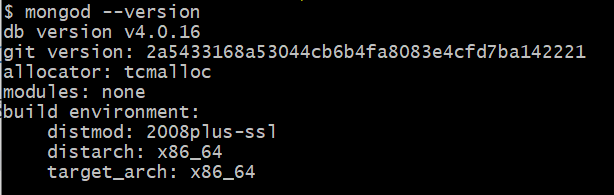
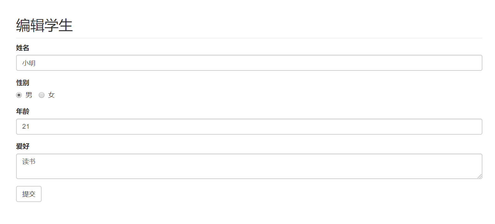

# 后台管理系统（mongoose增删改查）——CRUD 

## 下载运行
```bash
git clone https://github.com/hcq29/Learning-Node.js.git
cd Learning-Node.js
git checkout crud-mongoose
```

保证MoboDB安装成功并启动并连接（安装和介绍可看下面）

```shell
# 打开cmd，输入以下命令启动数据库
c:\>cd c:\
c:\>mkdir data
c:\>cd data
c:\data>mkdir db
c:\data>cd db
c:\data\db>

mongod
```

运行项目

```bash
node app.js
```


## MongoDB

### 介绍

MongoDB 是一个基于分布式文件存储的数据库。由 C++ 语言编写。旨在为 WEB 应用提供可扩展的高性能数据存储解决方案。

MongoDB 是一个介于关系数据库和非关系数据库之间的产品，是非关系数据库当中功能最丰富，最像关系数据库的。

### 下载和安装

MongoDB 各平台下载地址：[https://www.mongodb.com/download-center#community](https://www.mongodb.com/download-center#community)

- 安装完毕后进行配置环境变量
- 输入 `mongod --version` 即可查看版本



#### 相关教程和链接

菜鸟教程：  [https://www.runoob.com/mongodb/mongodb-tutorial.html](https://www.runoob.com/mongodb/mongodb-tutorial.html)

MongoDB 官网地址：[https://www.mongodb.com/](https://www.mongodb.com/)

MongoDB 官方英文文档：[https://docs.mongodb.com/manual/](https://docs.mongodb.com/manual/)

MongoDB 各平台下载地址：[https://www.mongodb.com/download-center#community](https://www.mongodb.com/download-center#community)

### 启动和关闭数据库

- 在想要存储数据库的硬盘中（如E盘）根路径创建文件目录   ： `/data/db`  

- 打开控制台，在控制台中输入  `mongod` ，回车，这时候就会在 E盘的 `E:\data\db`  路径中开启数据库。

- 在控制台中 `Ctrl + c` 即可关闭数据库。
- 可以通过以下方式修改默认的数据库存储目录

```shell
mongod --dbpath=数据库存储目录路径
```

### 连接数据库

在保证数据库开启的情况下连接数据库：

```shell
# 默认连接本机的 MongoDB 服务
mongo
```

退出：

```shell
exit
```

### 基本命令

- 查看已经存在的数据库

```shell
show dbs
# 以下是系统自带的数据库
admin   0.000GB
config  0.000GB
local   0.000GB
```

- 查看当前数据库

```shell
db
# 以下是未插入数据的默认数据库
test
```

- 插入数据

```shell
db.students.insertOne({'name':'Jack'})
# 向数据库 test 插入了一张表，表里存在以键值对形式存储的数据
{
        "acknowledged" : true,
        "insertedId" : ObjectId("5e3d2ce842c85ad3bb87af84")
}

show dbs
# 再次查看便有了 test 这个数据库
admin   0.000GB
config  0.000GB
local   0.000GB
test    0.000GB

```

- 查询数据库中所有表

```shell
show collections
students
```

- 查询表中的所有数据

```shell
db.students.find()
{ "_id" : ObjectId("5e3d2ce842c85ad3bb87af84"), "name" : "Jack" }
```


## Mongoose

适用于[node.js的](https://nodejs.org/en/)优雅[mongodb](https://www.mongodb.com/)对象建模，方便灵活

### 安装

首先，请确保您已安装[MongoDB](http://www.mongodb.org/downloads)和[Node.js](http://nodejs.org/)。

接下来使用`npm`以下命令从命令行安装Mongoose ：

```shell
$ npm install mongoose
```

### 在node中使用

#### 设计架构

```javascript
/**
* mgTest.js
*/
const mongoose = require('mongoose');
// 连接数据库
mongoose.connect('mongodb://localhost:27017/test', {useNewUrlParser: true});

// 设计集合结构，约束数据的类型，保证数据的完整性
// 将文档结构发布为模型
// mongoose.model 方法用来将一个架构发布为 model
    // 第一个参数： 传入一个大写名词单数字符串来表示数据库的名称
        // mongoose  会自动的将大写名词的字符串生成 小写复数 的集合名称
        // Cat ==》 cats
	// 第二个参数： 架构 Schema
	// var kittySchema = new mongoose.Schema({
  	//     name: String
	// });

// 返回值 ： 模型构造函数
const Cat = mongoose.model('Cat', { name: String });
// const Cat = mongoose.model('Cat', kittySchema);

// 添加数据
const kitty = new Cat({ name: 'Zildjian' });
// 保存数据
kitty.save().then(() => console.log('meow'));
```

结果

```shell
show collections
cats
students

db.cats.find()
{ "_id" : ObjectId("5e3d360dc20b8b03f85de559"), "name" : "Zildjian", "__v" : 0 }
```

### MongoDB 数据库的基本概念

- 数据库（拥有数据库）
- 集合
- 文档（集合里面是文档）

可以看成MongoDB就是一个 对象 `{}`  ，对对象进行操作。

| SQL术语/概念 | MongoDB术语/概念 | 解释/说明                           |
| :----------- | :--------------- | :---------------------------------- |
| database     | database         | 数据库                              |
| table        | collection       | 数据库表/集合                       |
| row          | document         | 数据记录行/文档                     |
| column       | field            | 数据字段/域                         |
| index        | index            | 索引                                |
| table joins  |                  | 表连接,MongoDB不支持                |
| primary key  | primary key      | 主键,MongoDB自动将_id字段设置为主键 |


### 运用示例

#### 查询:

使用以下代码在集合中存入数据

```javascript
const mongoose = require('mongoose');

mongoose.connect('mongodb://localhost:27017/user', {useNewUrlParser: true});

const userSchema = {
    name: String,
    age: Number,
    hobbise: String
}
const User = mongoose.model('User', userSchema);
const user1 = new User({
    name: 'Jack',
    age: 20,
    hobbise: '打球'
})
const user2 = new User({
    name: 'Mary',
    age: 21,
    hobbise: '唱歌'
})
const user3 = new User({
    name: 'Mike',
    age: 20,
    hobbise: '打球'
})
user1.save().then(() => console.log('插入成功'));
user2.save().then(() => console.log('插入成功'));
user3.save().then(() => console.log('插入成功'));
```

我们使用find进行查询所有

```javascript
User.find(function(err, res){
    if(err) return console.log('err');
    return console.log(res);
})
```

```javascript
[
  {
    _id: 5e3d55b574a68d15d00d4163,
    name: 'Jack',
    age: 20,
    hobbise: '打球',
    __v: 0
  },
  {
    _id: 5e3d55b574a68d15d00d4164,
    name: 'Mary',
    age: 21,
    hobbise: '唱歌',
    __v: 0
  },
  {
    _id: 5e3d55b574a68d15d00d4165,
    name: 'Mike',
    age: 20,
    hobbise: '打球',
    __v: 0
  }
]
```

使用findOne和find进行条件查询

```javascript
User.findOne({
    name: 'Mike'
},function(err, res){
    if(err) return console.log('err');
    return console.log(res);
})

User.find({
    name: 'Mike'
},function(err, res){
    if(err) return console.log('err');
    return console.log(res);
})
```

```javascript
// findOne
{
  _id: 5e3d538e3097ed47305f7d8b,
  name: 'Mike',
  age: 20,
  hobbise: '打球',
  __v: 0
}
// find
[
  {
    _id: 5e3d538e3097ed47305f7d8b,
    name: 'Mike',
    age: 20,
    hobbise: '打球',
    __v: 0
  }
]
```

可以看出使用find进行条件查询的话就是一个数组，可能包含多个结果，使用findOne的结果只有一个，所以就是一个对象。


#### 删除

```javascript

// 删除
User.remove({
    name: 'Mike'
},function(err, res){
    if(err) return console.log('error');
    return console.log(res); // { n: 1, ok: 1, deletedCount: 1 }
})
```


#### 更新

```javascript
var query = { name: 'Mary' };
User.findOneAndUpdate(query, { age: 20 }, function(err, res){
    if(err) return console.log('error');
    return console.log(res);
})
```


## 项目前期准备

### 安装配置

```bash
mkdir crud-mongoose
cd crud-mongoose/

npm init

npm install express --save
npm install art-template --save
npm install express-art-template --save
npm install express body-parser --save
npm install bootstrap --save
npm install mongoose --save
npm install nodemon --save
```

bootstrap网站实例： https://v3.bootcss.com/examples/dashboard/

改写index.html

```html
<!DOCTYPE html>
<html lang="zh-CN">
  <head>
    <meta charset="utf-8">
    <meta http-equiv="X-UA-Compatible" content="IE=edge">
    <meta name="viewport" content="width=device-width, initial-scale=1">
    <meta name="description" content="">
    <meta name="author" content="">
    <link rel="icon" href="../../favicon.ico">
    <title>学生管理系统</title>
    <!-- Bootstrap core CSS -->
    <link href="/node_modules/bootstrap/dist/css/bootstrap.min.css" rel="stylesheet">
    <!-- Custom styles for this template -->
    <link href="/public/css/main.css" rel="stylesheet">

  </head>
  <body>
      
    <nav class="navbar navbar-inverse navbar-fixed-top">
      <div class="container-fluid">
        <div class="navbar-header">
          <button type="button" class="navbar-toggle collapsed" data-toggle="collapse" data-target="#navbar" aria-expanded="false" aria-controls="navbar">
            <span class="sr-only">Toggle navigation</span>
            <span class="icon-bar"></span>
            <span class="icon-bar"></span>
            <span class="icon-bar"></span>
          </button>
          <a class="navbar-brand" href="#">学生管理系统</a>
        </div>
        <div id="navbar" class="navbar-collapse collapse">
          <ul class="nav navbar-nav navbar-right">
            <li><a href="#">仪表板</a></li>
            <li><a href="#">设置</a></li>
            <li><a href="#">简况</a></li>
            <li><a href="#">帮助</a></li>
          </ul>
          <form class="navbar-form navbar-right">
            <input type="text" class="form-control" placeholder="搜索...">
          </form>
        </div>
      </div>
    </nav>

    <div class="container-fluid">
      <div class="row">
        <div class="col-sm-3 col-md-2 sidebar">
          <ul class="nav nav-sidebar">
            <li class="active"><a href="#">概述 <span class="sr-only">(当前)</span></a></li>
            <li><a href="#">报告</a></li>
            <li><a href="#">分析</a></li>
            <li><a href="#">导出</a></li>
          </ul>
          <ul class="nav nav-sidebar">
            <li><a href="">导航栏</a></li>
            <li><a href="">Nav item again</a></li>
            <li><a href="">One more nav</a></li>
            <li><a href="">Another nav item</a></li>
            <li><a href="">More navigation</a></li>
          </ul>
          <ul class="nav nav-sidebar">
            <li><a href="">Nav item again</a></li>
            <li><a href="">One more nav</a></li>
            <li><a href="">Another nav item</a></li>
          </ul>
        </div>
        <div class="col-sm-9 col-sm-offset-3 col-md-10 col-md-offset-2 main">
          <h2 class="sub-header">学生信息</h2>
          <button class="btn btn-success">添加</button>
          <div class="table-responsive">
            <table class="table table-striped">
              <thead>
                <tr>
                  <th>序号</th>
                  <th>姓名</th>
                  <th>性别</th>
                  <th>年龄</th>
                  <th>爱好</th>
                </tr>
              </thead>
              <tbody>
                {{ each students}}
                    <tr>
                    <td>{{ $value.id }}</td>
                    <td>{{ $value.name }}</td>
                    <td>{{ $value.gender }}</td>
                    <td>{{ $value.age }}</td>
                    <td>{{ $value.hobbies }}</td>
                    </tr>
                {{ /each}}
              </tbody>
            </table>
          </div>
        </div>
      </div>
    </div>
    <script src="/node_modules/jquery/dist/jquery.js"></script>
    <script>window.jQuery || document.write('<script src="../../assets/js/vendor/jquery.min.js"><\/script>')</script>
    <script src="/node_modules/bootstrap/dist/js/bootstrap.min.js"></script>
    <!-- Just to make our placeholder images work. Don't actually copy the next line! -->
    <script src="/public/js/holder.min.js"></script>
    <!-- IE10 viewport hack for Surface/desktop Windows 8 bug -->
    <script src="/public/js/ie10-viewport-bug-workaround.js"></script>
  </body>
</html>

```

## 路由设计

| 请求方法 | 请求路径         | GET  | PPST                           | 备注             |
| -------- | ---------------- | ---- | ------------------------------ | ---------------- |
| GET      | /students        |      |                                | 渲染首页         |
| GET      | /students/new    |      |                                | 渲染添加学生页面 |
| POST     | /students/new    |      | name、gender、age、 hobbies    | 处理添加学生请求 |
| GET      | /students?id=xxx | id   |                                | 渲染编辑页面     |
| POST     | /students/edit   |      | id、name、gender、age、hobbies | 处理编辑请求     |
| GET      | /students/delete | id   |                                | 处理删除请求     |

### 路由模块的提取

#### router.js路由模块

- 处理路由
- 根据不同的请求方法 + 请求路径设置具体的请求函数

```javascript
/**
 * router.js
 */
// Express 提供了一个方式专门包装路由
const express = require('express');
// 创建一个路由容器
const router = express.Router();
const fs = require('fs');
const mongoose = require('mongoose');

mongoose.connect('mongodb://localhost:27017/user', { useNewUrlParser: true });

const studentSchema = {
    name: String,
    gender: Number,
    age: Number,
    hobbies: String,
    id: Number
}
// {"students":[{"name":"张三","gender":0,"age":2,"hobbies":"fff","id":0}]}

const Student = mongoose.model('Student', studentSchema);


// 把路由都挂在到 router 路由容器中
router.get('/students', (req, res) => {
    Student.find(function (err, students) {
        if (err) return res.status(500).end('Server Error....');
        console.log(students);
        if (students.length == 0) {
            res.render('index.html', {
                students: [
                    {
                        id: '无', name: '无', gender: '无', age: '无', hobbies: '无'
                    }
                ],
                show: false
            });
        } else {
            res.render('index.html', {
                students: students,
                show: true
            });
        }
    })

})
router.get('/students/new', (req, res) => {
    res.render('new.html');
})
router.post('/students/new', (req, res) => {
    // 1.获取表单数据
    // 2、处理
    // 3、发送相应
    Student.find(function (err, students) {
        if (err) return res.status(500).end('Server Error....');
        var id = 1;
        if(students.length != 0){
            id = parseInt(students[students.length - 1].id) + 1;
        }
        var studentObj = {};
        studentObj = req.body;
        studentObj.id = id;
        studentObj.age = parseInt(studentObj.age);
        studentObj.gender = parseInt(studentObj.gender);

        const newStudent = new Student(studentObj);
        newStudent.save().then(() => {res.redirect('/students');});

    })
})
router.get('/students/edit', (req, res) => {
    // 1、在客户端的列表页中处理链接问题（需要有 id 参数）
    // 2、获取要编辑的学生 id
    // 3、渲染编辑页面
    Student.findOne({id: parseInt(req.query.id)}, (err, student) => {
        if (err) return res.status(500).end('Server error....');
        res.render('edit.html', {
            student: student
        })
    })
})
router.post('/students/edit', (req, res) => {
    // 1、获取表单数据
    // 2、更新
    // 3、发送相应
    var id = parseInt(req.body.id);
    var query = { id: id};
    console.log(query)
    var studentObj = {};
        studentObj = req.body;
        studentObj.id = id;
        studentObj.age = parseInt(studentObj.age);
        studentObj.gender = parseInt(studentObj.gender);
    Student.findOneAndUpdate(query, studentObj, function(error, date){
        if (error) return res.status(500).end('Server error....');
        res.redirect('/students');
    })
})
router.get('/students/delete', (req, res) => {
    Student.remove({id:parseInt(req.query.id)}, (err) => {
        if (err) return res.status(500).end('Server error....');
        res.redirect('/students');
    })
})
// 把router导出
module.exports = router;
```


## app.js入口模块

- 启动服务
- 做一些服务相关的配置
  - 模板引擎
  - body-parser 解析表单 post 请求体
  - 提供静态资源服务
- 监听端口，启动服务
- 挂载使用路由

```javascript
/**
 * app.js
 */
const express = require('express');
const app = express();
const port = 3000;
const bodyParser = require('body-parser');
const router = require('./router');

app.engine('html', require('express-art-template'));

app.use(bodyParser.urlencoded({extended: false}));
app.use(bodyParser.json());

app.use('/public/', express.static('./public/'));
app.use('/node_modules/', express.static('./node_modules/'));
// 把路由容器挂载到 app 服务中
app.use(router);

app.listen(port, (error)=>{
    if(error) return console.log('服务器开启失败！');
    console.log('running in....' + port);
})
```

源代码请查看:：[https://github.com/hcq29/Learning-Node.js/tree/crud-mongoose](https://github.com/hcq29/Learning-Node.js/tree/crud-mongoose)

具体效果：





