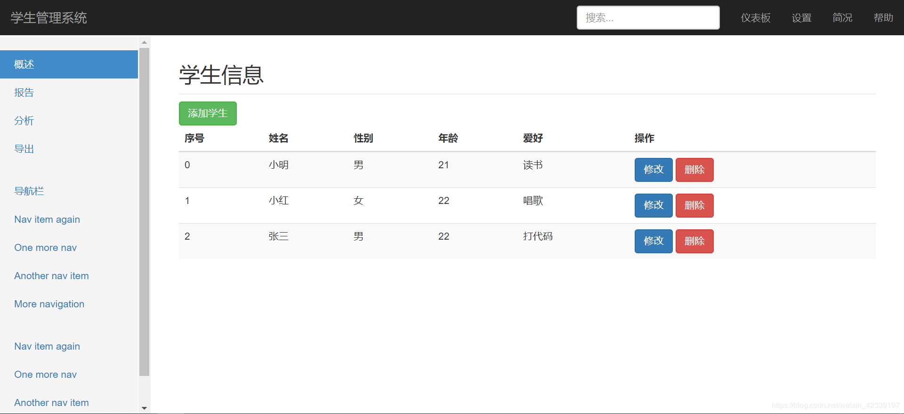
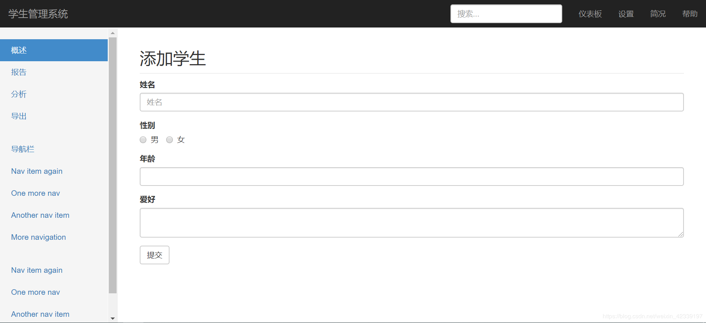
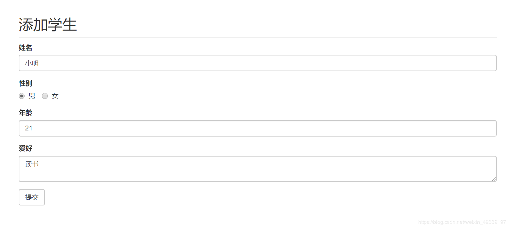

# 后台管理系统（文件式增删改查）——CRUD by Express

## 下载运行

```bash
git clone https://github.com/hcq29/Learning-Node.js.git
cd Learning-Node.js
git checkout crud
```

```bash
node app.js
```


## 前期准备

### 安装配置

```bash
mkdir crud-express
cd crud-express/

npm init
Press ^C at any time to quit.
package name: (crud-express)
version: (1.0.0)
description: 增删改查crud-express
entry point: (index.js)
test command:
git repository:
keywords:
author:
license: (ISC)
About to write to ..\笔记与代码\Learning-Node.js\Nodejs Code\18-CRUD-express\crud-express\package.json:

{
  "name": "crud-express",
  "version": "1.0.0",
  "description": "增删改查crud-express",
  "main": "index.js",
  "scripts": {
    "test": "echo \"Error: no test specified\" && exit 1"
  },
  "author": "",
  "license": "ISC"
}

Is this OK? (yes) y

npm install express --save
npm install art-template --save
npm install express-art-template --save
npm install express body-parser --save
npm install bootstrap --save
npm install nodemon --save
```

bootstrap网站实例： https://v3.bootcss.com/examples/dashboard/

改写index.html

```html
<!DOCTYPE html>
<html lang="zh-CN">
  <head>
    <meta charset="utf-8">
    <meta http-equiv="X-UA-Compatible" content="IE=edge">
    <meta name="viewport" content="width=device-width, initial-scale=1">
    <meta name="description" content="">
    <meta name="author" content="">
    <link rel="icon" href="../../favicon.ico">
    <title>学生管理系统</title>
    <!-- Bootstrap core CSS -->
    <link href="/node_modules/bootstrap/dist/css/bootstrap.min.css" rel="stylesheet">
    <!-- Custom styles for this template -->
    <link href="/public/css/main.css" rel="stylesheet">

  </head>
  <body>
      
    <nav class="navbar navbar-inverse navbar-fixed-top">
      <div class="container-fluid">
        <div class="navbar-header">
          <button type="button" class="navbar-toggle collapsed" data-toggle="collapse" data-target="#navbar" aria-expanded="false" aria-controls="navbar">
            <span class="sr-only">Toggle navigation</span>
            <span class="icon-bar"></span>
            <span class="icon-bar"></span>
            <span class="icon-bar"></span>
          </button>
          <a class="navbar-brand" href="#">学生管理系统</a>
        </div>
        <div id="navbar" class="navbar-collapse collapse">
          <ul class="nav navbar-nav navbar-right">
            <li><a href="#">仪表板</a></li>
            <li><a href="#">设置</a></li>
            <li><a href="#">简况</a></li>
            <li><a href="#">帮助</a></li>
          </ul>
          <form class="navbar-form navbar-right">
            <input type="text" class="form-control" placeholder="搜索...">
          </form>
        </div>
      </div>
    </nav>

    <div class="container-fluid">
      <div class="row">
        <div class="col-sm-3 col-md-2 sidebar">
          <ul class="nav nav-sidebar">
            <li class="active"><a href="#">概述 <span class="sr-only">(当前)</span></a></li>
            <li><a href="#">报告</a></li>
            <li><a href="#">分析</a></li>
            <li><a href="#">导出</a></li>
          </ul>
          <ul class="nav nav-sidebar">
            <li><a href="">导航栏</a></li>
            <li><a href="">Nav item again</a></li>
            <li><a href="">One more nav</a></li>
            <li><a href="">Another nav item</a></li>
            <li><a href="">More navigation</a></li>
          </ul>
          <ul class="nav nav-sidebar">
            <li><a href="">Nav item again</a></li>
            <li><a href="">One more nav</a></li>
            <li><a href="">Another nav item</a></li>
          </ul>
        </div>
        <div class="col-sm-9 col-sm-offset-3 col-md-10 col-md-offset-2 main">
          <h2 class="sub-header">学生信息</h2>
          <button class="btn btn-success">添加</button>
          <div class="table-responsive">
            <table class="table table-striped">
              <thead>
                <tr>
                  <th>序号</th>
                  <th>姓名</th>
                  <th>性别</th>
                  <th>年龄</th>
                  <th>爱好</th>
                </tr>
              </thead>
              <tbody>
                {{ each students}}
                    <tr>
                    <td>{{ $value.id }}</td>
                    <td>{{ $value.name }}</td>
                    <td>{{ $value.gender }}</td>
                    <td>{{ $value.age }}</td>
                    <td>{{ $value.hobbies }}</td>
                    </tr>
                {{ /each}}
              </tbody>
            </table>
          </div>
        </div>
      </div>
    </div>
    <script src="/node_modules/jquery/dist/jquery.js"></script>
    <script>window.jQuery || document.write('<script src="../../assets/js/vendor/jquery.min.js"><\/script>')</script>
    <script src="/node_modules/bootstrap/dist/js/bootstrap.min.js"></script>
    <!-- Just to make our placeholder images work. Don't actually copy the next line! -->
    <script src="/public/js/holder.min.js"></script>
    <!-- IE10 viewport hack for Surface/desktop Windows 8 bug -->
    <script src="/public/js/ie10-viewport-bug-workaround.js"></script>
  </body>
</html>

```

## 路由设计

| 请求方法 | 请求路径         | GET  | PPST                           | 备注             |
| -------- | ---------------- | ---- | ------------------------------ | ---------------- |
| GET      | /students        |      |                                | 渲染首页         |
| GET      | /students/new    |      |                                | 渲染添加学生页面 |
| POST     | /students/new    |      | name、gender、age、 hobbies    | 处理添加学生请求 |
| GET      | /students?id=xxx | id   |                                | 渲染编辑页面     |
| POST     | /students/edit   |      | id、name、gender、age、hobbies | 处理编辑请求     |
| GET      | /students/delete | id   |                                | 处理删除请求     |

### 路由模块的提取

#### router.js路由模块

- 处理路由
- 根据不同的请求方法 + 请求路径设置具体的请求函数

```javascript
/**
 * router.js
 */
// Express 提供了一个方式专门包装路由
const express = require('express');
// 创建一个路由容器
const router = express.Router();
const fs = require('fs');
const Student = require('./students');

// 把路由都挂在到 router 路由容器中
router.get('/students', (req, res) => {
    Student.find((err, students) => {
        //...
    })
})
router.get('/students/new', (req, res) => {
    res.render('new.html');
})
router.post('/students/new', (req, res) => {
    console.log(req.body)
    // ...
    // 1.获取表单数据
    // 2、处理
    //        将数据保存到students.json 文件中
    // 3、发送相应
    //     先读取文件，转成对象
    //     然后网对象中插入数据
    //     讲对象转为字符串
    //     将字符串再次写入文件
    Student.save(req.body, (err) => {
        if (err) return res.status(500).end('Server Error....');
        res.redirect('/students');
    })

})
router.get('/students/edit', (req, res) => {
    // 1、在客户端的列表页中处理链接问题（需要有 id 参数）
    // 2、获取要编辑的学生 id
    // 3、渲染编辑页面
    Student.findById(parseInt(req.query.id), (err, student)=>{
        if(err) return res.status(500).end('Server error....');
        res.render('edit.html',{
            student: student
        })
    })
})
router.post('/students/edit', (req, res) => {
    // 1、获取表单数据
    // 2、更新
    // 3、发送相应
    Student.update(req.body, (error)=>{
        if(error) return res.status(500).end('Server error....');
        res.redirect('/students');
    })
})
router.get('/students/delete', (req, res) => {
    Student.delete(parseInt(req.query.id), (err)=>{
        if(err) return res.status(500).end('Server error....');
        res.redirect('/students');
    })
})
// 把router导出
module.exports = router;
```


## app.js入口模块

- 启动服务
- 做一些服务相关的配置
  - 模板引擎
  - body-parser 解析表单 post 请求体
  - 提供静态资源服务
- 监听端口，启动服务
- 挂载使用路由

```javascript
/**
 * app.js
 */
const express = require('express');
const app = express();
const port = 3000;
const bodyParser = require('body-parser');
const router = require('./router');

app.engine('html', require('express-art-template'));

app.use(bodyParser.urlencoded({extended: false}));
app.use(bodyParser.json());

app.use('/public/', express.static('./public/'));
app.use('/node_modules/', express.static('./node_modules/'));
// 把路由容器挂载到 app 服务中
app.use(router);

app.listen(port, (error)=>{
    if(error) return console.log('服务器开启失败！');
    console.log('running in....' + port);
})
```

## 封装异步API

一般情况下，将函数作为参数就是为了获取函数内部的异步操作的结果，上层设计下层调用，这也是回调函数的作用所在。

```javascript
function fn(callback){
	// var callback = function(data) { console.log(data)}
	setTimeout(function(){
		var data = 'hello';
		callback(data);
	},1000)
}
// 如果需要获取一个函数中异步操作的结果，则必须通过回调函数来获取
fn(function(data){
	console.log(data);
})
```


```javascript
/**
 * students.js
 * 数据操作文件模块
 * 任务：操作文件中的数据，只处理数据，不管性业务
 * 
 */
const fs = require('fs');
const dbPath = './mock/db.json';

/**
 * 获取所有学生的列表
 */
exports.find = function (callback) {
    
}

/**
 * 查询对应学生 id 的所有信息
 */
exports.findById = function (id, callback) {
    
}

/**
 * 添加保存学生
 */
exports.save = function (student, callback) {
    // 1. 获取表单数据
	// 2. 处理
   	//- 将数据保存到db.json 文件中

	// 3. 发送相应
   //- 先读取文件，转成对象
   //- 然后网对象中插入数据
   //- 讲对象转为字符串
   //- 将字符串再次写入文件
}

/**
 * 更新学生
 */
exports.update = function (student, callback) {
    // 1、读取文件
    // 2、将文件中的字符串转为对象
    // 3、将 students 的 id 对应的 student 替换 
    // 4、重新写入文件
}

/**
 * 删除学生
 */
exports.delete = function (id, callback) {
    // 1、获取要删除学生的 id
    // 2、根据 id 执行删除操作
    // 3、根据操作结果进行发送相应结果
}

```

源代码请查看:：[https://github.com/hcq29/Learning-Node.js/tree/crud](https://github.com/hcq29/Learning-Node.js/tree/crud)

具体效果：








